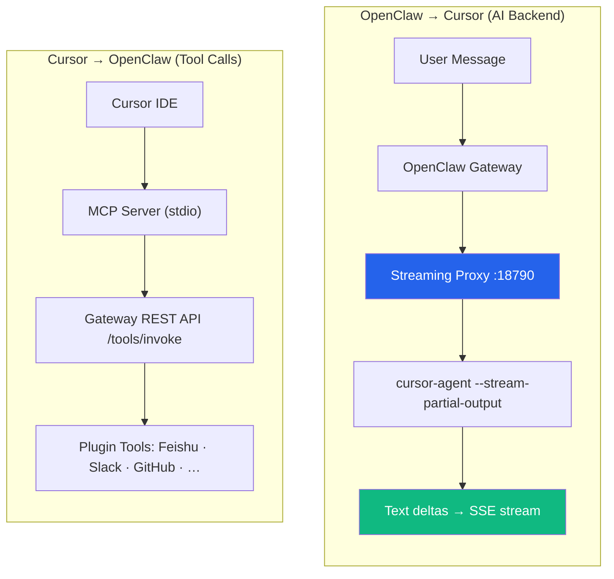

<p align="center">
  <h1 align="center">openclaw-cursor-brain</h1>
  <p align="center">
    Use <a href="https://cursor.sh">Cursor</a> as the AI brain for <a href="https://github.com/openclaw/openclaw">OpenClaw</a> — with full access to every plugin tool.
  </p>
  <p align="center">
    <a href="https://www.npmjs.com/package/openclaw-cursor-brain"></a>
    <a href="https://www.npmjs.com/package/openclaw-cursor-brain"></a>
    <a href="https://github.com/openclaw/openclaw"></a>
    <a href="https://cursor.sh"></a>
    <a href="https://nodejs.org">= 18"></a>
    <a href="https://opensource.org/licenses/MIT"></a>
    <br/>
    <a href="./README_ZH.md">中文文档</a>
  </p>
</p>

---

**openclaw-cursor-brain** is an [OpenClaw](https://github.com/openclaw/openclaw) plugin that turns [Cursor Agent CLI](https://cursor.sh) into a fully-integrated, streaming AI backend via [MCP](https://modelcontextprotocol.io). All OpenClaw plugin tools become natively accessible to Cursor — and vice versa.

## Quick Start

```bash
openclaw plugins install openclaw-cursor-brain
openclaw cursor-brain setup     # interactive model selection
openclaw gateway restart
openclaw cursor-brain doctor    # verify
```

During **setup** (and **upgrade**), models are dynamically discovered from `cursor-agent --list-models`. Primary is single-select; fallbacks are multi-select (space to toggle), defaulting to all models in cursor's original order:

```
◆  Select primary model (↑↓ navigate, enter confirm)
│  ● auto              Auto
│  ○ opus-4.6-thinking Claude 4.6 Opus (thinking, cursor default)
│  ○ opus-4.6          Claude 4.6 Opus
│  ○ sonnet-4.6        Claude 4.6 Sonnet
│  ○ gpt-5.3-codex     GPT-5.3 Codex
│  …
└

◆  Select fallback models (space toggle, enter confirm, order follows list)
│  ◼ opus-4.6-thinking Claude 4.6 Opus (thinking, cursor default)
│  ◼ opus-4.6          Claude 4.6 Opus
│  ◼ sonnet-4.6        Claude 4.6 Sonnet
│  …
└
```

## How It Works

<details>
<summary><strong>Architecture</strong></summary>



</details>

Two auto-configured paths:

1. **Streaming Proxy** — local OpenAI-compatible server (`/v1/chat/completions`) spawns `cursor-agent` with `--stream-partial-output`, streams text deltas as SSE in real-time
2. **MCP Server** — Cursor IDE calls OpenClaw tools via stdio, proxied to Gateway REST API with timeout/retry

Sessions are persisted to disk and reused via `--resume` for faster subsequent responses (context survives restarts). New plugins are auto-discovered on gateway restart.

## Bidirectional Enhancement

- **OpenClaw gains Cursor AI** — all channels (Slack, Feishu, Web, etc.) get Cursor's frontier models as the AI backend
- **Cursor IDE gains OpenClaw tools** — all plugin tools auto-registered as MCP tools, letting Cursor natively call Feishu, Slack, GitHub, databases, etc.
- **Compound effect** — a single agent session can read Slack, write code, push to GitHub, and notify on Feishu — no context switching

## Features

- **Zero config** — install and restart; everything auto-configures
- **Interactive model selection** — `setup`/`upgrade` present all discovered models via `@clack/prompts` (single-select primary, multi-select ordered fallbacks)
- **Dynamic model discovery** — models auto-detected from `cursor-agent --list-models`, synced to OpenClaw on every gateway start
- **Real-time streaming** — `--stream-partial-output` for character-level text deltas; smart-chunked fallback for batch results (~200 chars/s, configurable)
- **Tool auto-discovery** — source scanning + REST API parallel verification
- **Session persistence** — cursor-agent sessions persisted to disk (`~/.openclaw/cursor-sessions.json`), surviving proxy and gateway restarts; `--resume` reuses sessions automatically
- **Standalone proxy** — `streaming-proxy.mjs` runs independently as OpenAI-compatible API (auto-detection, API key auth, CORS)
- **Reliability** — tool call timeout (60s), retry (2x), structured MCP errors (`isError: true`)
- **Proxy management** — `proxy status/stop/restart/log` commands for lifecycle control without restarting gateway
- **Diagnostics** — `doctor` (10+ checks), `status`, and `proxy log` commands
- **Cross-platform** — macOS, Linux, Windows

## Configuration

In `openclaw.json` under `plugins.entries.openclaw-cursor-brain.config`:

| Option | Type | Default | Description |
|---|---|---|---|
| `cursorPath` | string | auto-detect | Path to cursor-agent binary |
| `model` | string | interactive | Primary model (override to skip interactive selection) |
| `fallbackModel` | string | interactive | Fallback model override (interactive selection provides ordered multi-fallbacks) |
| `cursorModel` | string | `""` (auto) | Direct `cursor-agent --model` override (e.g. `sonnet-4.6`, `opus-4.6-thinking`) |
| `outputFormat` | string | auto-detect | `"stream-json"` or `"json"` |
| `proxyPort` | number | `18790` | Streaming proxy port |

<details>
<summary><strong>Environment variables</strong></summary>

| Variable | Default | Description |
|---|---|---|
| `OPENCLAW_TOOL_TIMEOUT_MS` | `60000` | Tool call timeout (ms) |
| `OPENCLAW_TOOL_RETRY_COUNT` | `2` | Max retries on transient errors |
| `CURSOR_PROXY_STREAM_SPEED` | `200` | Chunked streaming speed (chars/sec) |
| `CURSOR_PROXY_REQUEST_TIMEOUT` | `300000` | Per-request timeout in ms (default 5 min) |
| `CURSOR_PROXY_API_KEY` | *(none)* | API key for standalone proxy auth |

</details>

## CLI Commands

| Command | Description |
|---|---|
| `openclaw cursor-brain setup` | Configure MCP + interactive model selection |
| `openclaw cursor-brain doctor` | Health check (10+ items) |
| `openclaw cursor-brain status` | Show versions, config, models & tool count |
| `openclaw cursor-brain upgrade <source>` | One-command upgrade + model selection |
| `openclaw cursor-brain uninstall` | Full uninstall (configs + files) |
| `openclaw cursor-brain proxy` | Show proxy status (PID, port, sessions) |
| `openclaw cursor-brain proxy stop` | Stop the streaming proxy |
| `openclaw cursor-brain proxy restart` | Restart proxy (detached) |
| `openclaw cursor-brain proxy log [-n N]` | Show last N lines of proxy log (default 30) |

## Standalone Streaming Proxy

The proxy works without OpenClaw, turning any Cursor into an OpenAI-compatible API:

```bash
node mcp-server/streaming-proxy.mjs
# with options:
CURSOR_PROXY_PORT=8080 CURSOR_PROXY_API_KEY=secret node mcp-server/streaming-proxy.mjs
```

```bash
curl http://127.0.0.1:18790/v1/chat/completions \
  -H "Content-Type: application/json" \
  -d '{"model":"auto","stream":true,"messages":[{"role":"user","content":"Hello!"}]}'
```

Endpoints: `POST /v1/chat/completions`, `GET /v1/models`, `GET /v1/health`. Supports API key auth, CORS, and session reuse.

<details>
<summary><strong>Auto-configured files</strong></summary>

### ~/.cursor/mcp.json

```json
{
  "mcpServers": {
    "openclaw-gateway": {
      "command": "node",
      "args": ["<plugin-path>/mcp-server/server.mjs"],
      "env": {
        "OPENCLAW_GATEWAY_URL": "http://127.0.0.1:<port>",
        "OPENCLAW_GATEWAY_TOKEN": "<token>"
      }
    }
  }
}
```

### openclaw.json (after interactive selection)

```json
{
  "agents": {
    "defaults": {
      "model": {
        "primary": "cursor-local/auto",
        "fallbacks": ["cursor-local/opus-4.6", "cursor-local/sonnet-4.6", "..."]
      }
    }
  },
  "models": {
    "providers": {
      "cursor-local": {
        "api": "openai-completions",
        "baseUrl": "http://127.0.0.1:18790/v1",
        "apiKey": "local",
        "models": [
          {"id": "auto", "name": "Auto"},
          {"id": "opus-4.6", "name": "Claude 4.6 Opus"},
          "..."
        ]
      }
    }
  }
}
```

</details>

<details>
<summary><strong>Troubleshooting</strong></summary>

| Problem | Fix |
|---|---|
| "Cursor Agent CLI not found" | Install Cursor and launch once, or set `config.cursorPath` |
| Gateway error | Confirm gateway running (`openclaw gateway status`), check token |
| Tools not appearing | Restart gateway, call `openclaw_discover` in Cursor |
| Tool timeout | Set `OPENCLAW_TOOL_TIMEOUT_MS=120000` |
| Proxy not starting | `openclaw cursor-brain proxy log` to check; `proxy restart` to force start |
| Context lost after restart | Sessions auto-persist to disk; use `proxy restart` (not `gateway restart`) to keep sessions |
| Debug MCP server | `OPENCLAW_GATEWAY_URL=... node mcp-server/server.mjs` |

</details>

<details>
<summary><strong>Project structure</strong></summary>

```
openclaw-cursor-brain/
  index.ts                  # Plugin entry (register + CLI commands)
  openclaw.plugin.json      # Plugin metadata + config schema
  src/
    constants.ts            # Paths, IDs, output format types
    setup.ts                # Idempotent setup, model discovery, format detection
    doctor.ts               # Health checks (11 items)
    cleanup.ts              # Uninstall cleanup
  mcp-server/
    server.mjs              # MCP server (tool discovery, timeout/retry)
    streaming-proxy.mjs     # OpenAI-compatible streaming proxy
```

</details>

## License

[MIT](./LICENSE)
