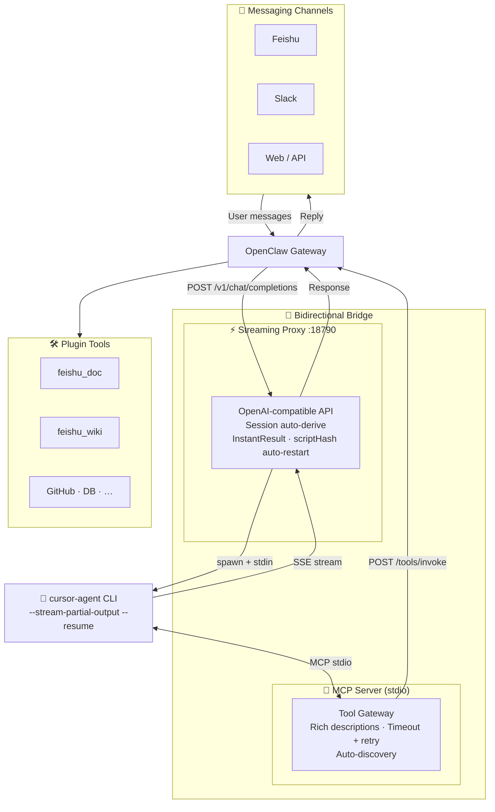

<p align="center">
  <a href="https://github.com/openclaw/openclaw"></a>
  &nbsp;&nbsp;&nbsp;&nbsp;
  <a href="https://cursor.sh"></a>
  <h1 align="center">openclaw-cursor-brain</h1>
  <p align="center">
    Use <a href="https://cursor.sh">Cursor</a> as the AI brain for <a href="https://github.com/openclaw/openclaw">OpenClaw</a> — with full access to every plugin tool.
  </p>
  <p align="center">
    <a href="https://www.npmjs.com/package/openclaw-cursor-brain"></a>
    <a href="https://www.npmjs.com/package/openclaw-cursor-brain"></a>
    <a href="https://github.com/openclaw/openclaw"></a>
    <a href="https://cursor.sh"></a>
    <a href="https://nodejs.org">= 18"></a>
    <a href="https://opensource.org/licenses/MIT"></a>
    <br/>
    <a href="./README_ZH.md">中文文档</a> · <a href="./doc/technical-guide-en.md">Technical Guide</a> · <a href="./doc/technical-guide-zh.md">技术设计文档</a>
  </p>
</p>

---

**openclaw-cursor-brain** is an [OpenClaw](https://github.com/openclaw/openclaw) plugin that turns [Cursor Agent CLI](https://cursor.sh) into a fully-integrated, streaming AI backend via [MCP](https://modelcontextprotocol.io). All OpenClaw plugin tools become natively accessible to Cursor — and vice versa.

## Prerequisites

- [Cursor IDE](https://cursor.sh) installed and launched at least once
- Cursor Agent CLI enabled: open Cursor → `Cmd+Shift+P` → type **Install 'cursor' command** → Enter. Or execute shell `curl https://cursor.com/install -fsS | bash`. (after this, `cursor-agent` or `agent` is available in the terminal)

- [OpenClaw](https://github.com/openclaw/openclaw) installed globally (`npm i -g openclaw`)
- Node.js ≥ 18

## Quick Start

```bash
openclaw plugins install openclaw-cursor-brain # install & default config
openclaw gateway restart                       # restart gateway
openclaw cursor-brain doctor                   # verify
```

**Model selection** (optional): In a TTY, interactive model selection may run automatically after install. Otherwise run:

```bash
openclaw cursor-brain setup   # optional: choose primary & fallback models
openclaw gateway restart      # if you changed config
```

During **setup** (and **upgrade**), models are dynamically discovered from `cursor-agent --list-models`. Primary is single-select; fallbacks are multi-select (space to toggle), defaulting to all models in cursor's original order:

```
◆  Select primary model (↑↓ navigate, enter confirm)
│  ● auto              Auto
│  ○ opus-4.6-thinking Claude 4.6 Opus (thinking, cursor default)
│  ○ opus-4.6          Claude 4.6 Opus
│  ○ sonnet-4.6        Claude 4.6 Sonnet
│  ○ gpt-5.3-codex     GPT-5.3 Codex
│  …
└

◆  Select fallback models (space toggle, enter confirm, order follows list)
│  ◼ opus-4.6-thinking Claude 4.6 Opus (thinking, cursor default)
│  ◼ opus-4.6          Claude 4.6 Opus
│  ◼ sonnet-4.6        Claude 4.6 Sonnet
│  …
└
```

## How It Works


<details>
<summary>View diagram source</summary>



</details>

Two auto-configured paths:

1. **Streaming Proxy** — local OpenAI-compatible server (`/v1/chat/completions`) spawns `cursor-agent` with `--stream-partial-output`, streams text deltas as SSE in real-time. Includes tool call logging, instant result delivery, optional thinking forwarding, and script hash-based auto-restart on upgrade.
2. **MCP Server** — Cursor IDE calls OpenClaw tools via stdio, proxied to Gateway REST API with timeout/retry. Server instructions include rich tool descriptions (token extraction rules, action keys, parameter examples) to minimize unnecessary `openclaw_skill` calls.

Sessions are persisted to disk and reused via `--resume` for faster subsequent responses (context survives restarts). Session IDs are automatically derived from conversation metadata embedded in user messages (e.g., `sender_id` for DM, `group_channel` + `topic_id` for group chats), or can be passed explicitly via body fields (`_openclaw_session_id`, `session_id`) or HTTP headers (`X-OpenClaw-Session-Id`, `X-Session-Id`). New plugins are auto-discovered on gateway restart.

## Bidirectional Enhancement

- **OpenClaw gains Cursor AI** — all channels (Slack, Feishu, Web, etc.) get Cursor's frontier models as the AI backend
- **Cursor IDE gains OpenClaw tools** — all plugin tools auto-registered as MCP tools, letting Cursor natively call Feishu, Slack, GitHub, databases, etc.
- **Compound effect** — a single agent session can read Slack, write code, push to GitHub, and notify on Feishu — no context switching

## Features

- **Zero config** — install and restart; everything auto-configures
- **Interactive model selection** — `setup`/`upgrade` present all discovered models via `@clack/prompts` (single-select primary, multi-select ordered fallbacks)
- **Dynamic model discovery** — models auto-detected from `cursor-agent --list-models`, synced to OpenClaw on every gateway start
- **Real-time streaming** — `--stream-partial-output` for character-level text deltas; instant result by default (plugin config `instantResult`), with optional smart-chunked fallback
- **Thinking forwarding** — optionally stream LLM reasoning via `reasoning_content` (plugin config `forwardThinking`)
- **Rich tool descriptions** — MCP server instructions include token extraction rules, exact action keys, and parameter examples from SKILL.md — reducing unnecessary `openclaw_skill` calls
- **Tool call logging** — proxy logs every tool invocation with name, arguments summary, duration, and call ID for diagnostics
- **Tool auto-discovery** — disk-based registration from SKILL.md at startup (no Gateway dependency); background verification for diagnostics; cached with 60s TTL
- **Session auto-derive** — session keys automatically derived from conversation metadata (sender/group/topic) in user messages; no explicit session ID required from Gateway
- **Session persistence** — cursor-agent sessions persisted to disk (`~/.openclaw/cursor-sessions.json`); explicit session IDs also accepted via body fields or HTTP headers (`X-OpenClaw-Session-Id`, `X-Session-Id`)
- **Auto-restart on upgrade** — proxy exposes a `scriptHash` in `/v1/health`; gateway compares it against the installed script hash and auto-restarts when code changes
- **Three-layer fault tolerance** — request-level: auto-clear stale session and retry once; process-level: self-exit after consecutive failures to trigger restart; gateway-level: exponential backoff auto-restart on crash (2s → 10s → 60s, resets after 5min stable)
- **Version guard** — `upgrade` command detects version comparison; downgrade or same-version requires confirmation
- **Standalone proxy** — `streaming-proxy.mjs` runs independently as OpenAI-compatible API (auto-detection, API key auth, CORS)
- **Reliability** — tool call timeout (60s), retry (2x), structured MCP errors (`isError: true`)
- **Proxy management** — `proxy status/stop/restart/log` commands for lifecycle control without restarting gateway
- **Diagnostics** — `doctor` (10+ checks), `status`, and `proxy log` commands
- **Request safety** — request body size limit (10 MB), per-request timeout, graceful client disconnect handling
- **Cross-platform** — macOS, Linux, Windows (port management, health checks)

## Configuration

In `openclaw.json` under `plugins.entries.openclaw-cursor-brain.config`:

| Option         | Type   | Default     | Description                 |
| -------------- | ------ | ----------- | --------------------------- |
| `cursorPath`   | string | auto-detect | Path to cursor-agent binary |
| `outputFormat` | string | auto-detect | `"stream-json"` or `"json"` |
| `proxyPort`    | number | `18790`     | Streaming proxy port        |

Primary and fallback models are **not** in plugin config; they are stored in `agents.defaults.model` (primary + fallbacks array) and in `models.providers.cursor-local`. Use `openclaw cursor-brain setup` or the upgrade flow to set them interactively.

<details>
<summary><strong>Plugin config & env</strong></summary>

**Proxy options** (timeout, retry thresholds, streaming) are configured only in **openclaw.json** under `plugins.entries.openclaw-cursor-brain.config`. OpenClaw allows custom fields there; the plugin syncs them to `~/.openclaw/cursor-proxy.json` when starting the proxy, and the proxy reads that file (no custom env vars). Set e.g. `requestTimeout`, `degradedTimeout`, `maxConsecutiveFailures`, `maxConsecutiveTimeouts`, `streamResolveGraceMs`, `instantResult`, `forwardThinking`, `streamSpeed` in plugin config. The file is **not** removed on uninstall (reinstall keeps your settings). **Upgrade** preserves plugin config in openclaw.json (requestTimeout, etc.): the upgrade command saves it before uninstall and restores it after install; cursor-proxy.json is merge-only so existing file values are kept.

| Variable                    | Default  | Description                          |
| --------------------------- | -------- | ------------------------------------ |
| `OPENCLAW_TOOL_TIMEOUT_MS`  | `60000`  | MCP tool call timeout (ms)           |
| `OPENCLAW_TOOL_RETRY_COUNT` | `2`      | MCP retries on transient errors      |
| `CURSOR_PROXY_PORT`         | `18790`  | Port (when running proxy standalone) |
| `CURSOR_PROXY_API_KEY`      | _(none)_ | API key for standalone proxy auth    |

</details>

## CLI Commands

| Command                                  | Description                                 |
| ---------------------------------------- | ------------------------------------------- |
| `openclaw cursor-brain setup`            | Configure MCP + interactive model selection |
| `openclaw cursor-brain doctor`           | Health check (10+ items)                    |
| `openclaw cursor-brain status`           | Show versions, config, models & tool count  |
| `openclaw cursor-brain upgrade <source>` | One-command upgrade + model selection       |
| `openclaw cursor-brain uninstall`        | Full uninstall (configs + files)            |
| `openclaw cursor-brain proxy`            | Show proxy status (PID, port, sessions)     |
| `openclaw cursor-brain proxy stop`       | Stop the streaming proxy                    |
| `openclaw cursor-brain proxy restart`    | Restart proxy (detached)                    |
| `openclaw cursor-brain proxy log [-n N]` | Show last N lines of proxy log (default 30) |

## Standalone Streaming Proxy

The proxy works without OpenClaw, turning any Cursor into an OpenAI-compatible API:

```bash
node mcp-server/streaming-proxy.mjs
# with options:
CURSOR_PROXY_PORT=8080 CURSOR_PROXY_API_KEY=secret node mcp-server/streaming-proxy.mjs
```

```bash
curl http://127.0.0.1:18790/v1/chat/completions \
  -H "Content-Type: application/json" \
  -d '{"model":"auto","stream":true,"messages":[{"role":"user","content":"Hello!"}]}'
```

Endpoints: `POST /v1/chat/completions`, `GET /v1/models`, `GET /v1/health` (returns `scriptHash` for version detection). Supports API key auth, CORS, session reuse via body or headers.

<details>
<summary><strong>Auto-configured files</strong></summary>

### ~/.cursor/mcp.json

```json
{
  "mcpServers": {
    "openclaw-gateway": {
      "command": "node",
      "args": ["<plugin-path>/mcp-server/server.mjs"],
      "env": {
        "OPENCLAW_GATEWAY_URL": "http://127.0.0.1:<port>",
        "OPENCLAW_GATEWAY_TOKEN": "<token>",
        "OPENCLAW_CONFIG_PATH": "~/.openclaw/openclaw.json"
      }
    }
  }
}
```

### openclaw.json (after interactive selection)

```json
{
  "agents": {
    "defaults": {
      "model": {
        "primary": "cursor-local/auto",
        "fallbacks": ["cursor-local/opus-4.6", "cursor-local/sonnet-4.6", "..."]
      }
    }
  },
  "models": {
    "providers": {
      "cursor-local": {
        "api": "openai-completions",
        "baseUrl": "http://127.0.0.1:18790/v1",
        "apiKey": "local",
        "models": [
          { "id": "auto", "name": "Auto" },
          { "id": "opus-4.6", "name": "Claude 4.6 Opus" },
          "..."
        ]
      }
    }
  }
}
```

</details>

<details>
<summary><strong>Troubleshooting</strong></summary>

| Problem                                                            | Fix                                                                                                                                                                                                                                                                                                                                                                                                                                                                                                            |
| ------------------------------------------------------------------ | -------------------------------------------------------------------------------------------------------------------------------------------------------------------------------------------------------------------------------------------------------------------------------------------------------------------------------------------------------------------------------------------------------------------------------------------------------------------------------------------------------------- |
| **WARNING: dangerous code patterns (child_process / env+network)** | OpenClaw scans plugins and may show this during install. This plugin legitimately uses `child_process` to run the Cursor agent and proxy, and reads env (e.g. `CURSOR_PATH`) to configure them. The plugin only passes a minimal env whitelist to the proxy child, not full `process.env`. You can ignore this warning for this plugin.                                                                                                                                                                        |
| **Stuck after "Provider synced"**                                  | Old versions started proxy/timers during install; fixed in current release. Upgrade to latest.                                                                                                                                                                                                                                                                                                                                                                                                                 |
| **No model selection during install**                              | Runs only in a TTY; otherwise run `openclaw cursor-brain setup` after install.                                                                                                                                                                                                                                                                                                                                                                                                                                 |
| **Invalid config … source / unknown command 'cursor-brain'**       | Old versions wrote invalid `source: "tarball"`. New version auto-fixes on register. If it still fails, edit `~/.openclaw/openclaw.json`, set `plugins.installs.openclaw-cursor-brain.source` to `"archive"` (or `"path"` for local install), save, then run `openclaw plugins install ./` again.                                                                                                                                                                                                               |
| **plugins.allow / plugins.entries: plugin not found**              | Stale config references the uninstalled plugin; `openclaw doctor --fix` may not remove it. From the project dir run **`npm run uninstall`**, then `openclaw plugins install ./`. Or edit `~/.openclaw/openclaw.json`: remove `openclaw-cursor-brain` from `plugins.allow` and delete `plugins.entries.openclaw-cursor-brain`.                                                                                                                                                                                  |
| **No API key found for provider "anthropic"**                      | The default model is anthropic (needs API key), not cursor-local. Use local Cursor: run `openclaw config set agents.defaults.model.primary "cursor-local/auto"`, or `openclaw cursor-brain setup` to pick cursor-local/auto, then `openclaw gateway restart`. If an agent overrides to anthropic, check `openclaw config get agents.list` and fix that agent’s `model.primary`.                                                                                                                                |
| "Cursor Agent CLI not found"                                       | Install Cursor and launch once, or set `config.cursorPath`                                                                                                                                                                                                                                                                                                                                                                                                                                                     |
| Gateway error                                                      | Confirm gateway running (`openclaw gateway status`), check token                                                                                                                                                                                                                                                                                                                                                                                                                                               |
| Tools not appearing                                                | Restart gateway, call `openclaw_discover` in Cursor                                                                                                                                                                                                                                                                                                                                                                                                                                                            |
| Tool timeout                                                       | Set `OPENCLAW_TOOL_TIMEOUT_MS=120000`                                                                                                                                                                                                                                                                                                                                                                                                                                                                          |
| Proxy not starting                                                 | `openclaw cursor-brain proxy log` to check; `proxy restart` to force start                                                                                                                                                                                                                                                                                                                                                                                                                                     |
| **Cursor rate limit / 504 timeout / proxy keeps exiting**          | When Cursor is rate-limited, requests slow down. Defaults: 5 min request timeout, 5 min when degraded; health reports "degraded" only when consecutive failures ≥4 or consecutive timeouts ≥2, so Gateway does not restart proxy on a single timeout. Non-stream requests accumulate agent text output so partial content is returned if any was received before timeout. Channels like Feishu often have ~50–60s reply timeout; if Cursor is often slower, reduce concurrency or wait for rate limit to ease. |
| Proxy not updating after upgrade                                   | Gateway auto-restarts proxy when `scriptHash` differs; verify with `curl http://127.0.0.1:18790/v1/health`                                                                                                                                                                                                                                                                                                                                                                                                     |
| Slow batch responses                                               | In plugin config set `instantResult: false`; then batch results are chunked at ~200 chars/s                                                                                                                                                                                                                                                                                                                                                                                                                    |
| Context lost between messages                                      | Check `~/.openclaw/logs/cursor-proxy.log` for `session=auto:dm:…(meta.auto)` — if showing `session=none(none)`, ensure Gateway embeds "Conversation info" metadata in user messages                                                                                                                                                                                                                                                                                                                            |
| Context lost after restart                                         | Sessions auto-persist to disk; use `proxy restart` (not `gateway restart`) to keep sessions                                                                                                                                                                                                                                                                                                                                                                                                                    |
| Debug MCP server                                                   | `OPENCLAW_GATEWAY_URL=... node mcp-server/server.mjs`                                                                                                                                                                                                                                                                                                                                                                                                                                                          |
| Debug tool calls                                                   | Check `~/.openclaw/logs/cursor-proxy.log` for `tool:start` / `tool:done` entries                                                                                                                                                                                                                                                                                                                                                                                                                               |

</details>

<details>
<summary><strong>Project structure</strong></summary>

```
openclaw-cursor-brain/
  index.ts                  # Plugin entry (register + CLI commands)
  openclaw.plugin.json      # Plugin metadata + config schema
  src/
    constants.ts            # Paths, IDs, output format types
    setup.ts                # Idempotent setup, model discovery, format detection
    doctor.ts               # Health checks (11 items)
  scripts/
    uninstall.mjs           # Uninstall: config + MCP + extension dir
  mcp-server/
    server.mjs              # MCP server (tool discovery, timeout/retry)
    streaming-proxy.mjs     # OpenAI-compatible streaming proxy
```

</details>

## License

[MIT](./LICENSE)
