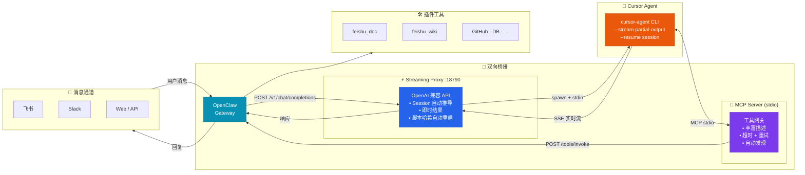

<p align="center">
  <a href="https://github.com/openclaw/openclaw"></a>
  &nbsp;&nbsp;&nbsp;&nbsp;
  <a href="https://cursor.sh"></a>
  <h1 align="center">openclaw-cursor-brain</h1>
  <p align="center">
    将 <a href="https://cursor.sh">Cursor</a> 作为 <a href="https://github.com/openclaw/openclaw">OpenClaw</a> 的 AI 大脑 — 原生调用所有插件工具
  </p>
  <p align="center">
    <a href="https://www.npmjs.com/package/openclaw-cursor-brain"></a>
    <a href="https://www.npmjs.com/package/openclaw-cursor-brain"></a>
    <a href="https://github.com/openclaw/openclaw"></a>
    <a href="https://cursor.sh"></a>
    <a href="https://nodejs.org">= 18"></a>
    <a href="https://opensource.org/licenses/MIT"></a>
    <br/>
    <a href="./README.md">English</a> | 中文 · <a href="./doc/technical-guide-zh.md">技术设计文档</a> · <a href="./doc/technical-guide-en.md">Technical Guide</a>
  </p>
</p>

---

**openclaw-cursor-brain** 是一个 [OpenClaw](https://github.com/openclaw/openclaw) 插件，将 [Cursor Agent CLI](https://cursor.sh) 作为实时流式 AI 后端，通过 [MCP](https://modelcontextprotocol.io) 连接所有插件工具，让 AI 原生调用飞书、Slack、GitHub 等能力。

## 快速开始

```bash
openclaw plugins install openclaw-cursor-brain
openclaw cursor-brain setup     # 交互选择模型
openclaw gateway restart
openclaw cursor-brain doctor    # 验证
```

**setup** 和 **upgrade** 时自动从 `cursor-agent --list-models` 发现可用模型。主模型单选，备用模型多选（空格切换），默认按 cursor 原始顺序全选：

```
◆  Select primary model (↑↓ navigate, enter confirm)
│  ● auto              Auto
│  ○ opus-4.6-thinking Claude 4.6 Opus (thinking, cursor default)
│  ○ opus-4.6          Claude 4.6 Opus
│  ○ sonnet-4.6        Claude 4.6 Sonnet
│  ○ gpt-5.3-codex     GPT-5.3 Codex
│  …
└

◆  Select fallback models (space toggle, enter confirm, order follows list)
│  ◼ opus-4.6-thinking Claude 4.6 Opus (thinking, cursor default)
│  ◼ opus-4.6          Claude 4.6 Opus
│  ◼ sonnet-4.6        Claude 4.6 Sonnet
│  …
└
```

## 工作原理



两条自动配置的路径：

1. **Streaming Proxy** — 本地 OpenAI 兼容服务器（`/v1/chat/completions`）启动 `cursor-agent`，通过 `--stream-partial-output` 实时推送文本增量。包含工具调用日志、批量结果即时发送、可选推理过程转发、脚本哈希自动重启。
2. **MCP Server** — Cursor IDE 通过 stdio 调用 OpenClaw 工具，转发到 Gateway REST API（带超时/重试）。服务器指令包含丰富的工具描述（token 提取规则、action 键、参数示例），减少不必要的 `openclaw_skill` 调用。

会话自动从消息元数据中推导 session key（如 `sender_id` 用于私聊，`group_channel` + `topic_id` 用于群聊），持久化到磁盘，通过 `--resume` 复用（重启不丢上下文）。也支持通过 body 字段（`_openclaw_session_id`、`session_id`）或 HTTP 头（`X-OpenClaw-Session-Id`、`X-Session-Id`）显式传递。新插件重启 Gateway 后自动发现。

## 双向增强

- **OpenClaw 获得 Cursor AI** — 所有通道（Slack、飞书、Web 等）获得 Cursor 前沿模型作为 AI 后端
- **Cursor IDE 获得 OpenClaw 工具** — 所有插件工具自动注册为 MCP 工具，Cursor 可原生调用飞书、Slack、GitHub、数据库等
- **复合效应** — 单个 Agent 会话可读取 Slack、编写代码、推送 GitHub、通知飞书 — 无需切换上下文

## 功能特性

- **零配置** — 安装重启即可，一切自动配置
- **交互式模型选择** — `setup`/`upgrade` 通过 `@clack/prompts` 展示所有发现的模型（主模型单选，备用模型按顺序多选）
- **动态模型发现** — 自动从 `cursor-agent --list-models` 获取模型列表，每次 Gateway 启动时同步
- **实时流式** — `--stream-partial-output` 逐字输出；批量结果默认即时发送（`CURSOR_PROXY_INSTANT_RESULT=true`），可选智能分块回退
- **推理过程转发** — 可选通过 `reasoning_content` 流式输出 LLM 推理过程（`CURSOR_PROXY_FORWARD_THINKING=true`）
- **丰富工具描述** — MCP 服务器指令包含 token 提取规则、精确 action 键和参数示例（来自 SKILL.md），减少不必要的 `openclaw_skill` 调用
- **工具调用日志** — proxy 记录每个工具调用的名称、参数摘要、耗时和 call ID，便于诊断
- **工具自动发现** — 源码扫描 + REST API 并行验证；60s TTL 缓存
- **Session 自动推导** — 自动从消息元数据（sender/group/topic）推导 session key，Gateway 无需显式传递 session ID
- **会话持久化** — cursor-agent 会话持久化到磁盘（`~/.openclaw/cursor-sessions.json`）；也支持通过 body 字段或 HTTP 头（`X-OpenClaw-Session-Id`、`X-Session-Id`）显式传递
- **升级自动重启** — proxy 在 `/v1/health` 暴露 `scriptHash`；Gateway 比较哈希值，代码变更后自动重启
- **独立代理** — `streaming-proxy.mjs` 可独立运行为 OpenAI 兼容 API（自动检测、API Key、CORS）
- **可靠性** — 工具调用超时（60s）、重试（2 次）、结构化错误（`isError: true`）
- **请求安全** — 请求体大小限制（10 MB）、单请求超时、客户端断连优雅处理
- **代理管理** — `proxy status/stop/restart/log` 命令独立管控代理生命周期，无需重启 Gateway
- **诊断** — `doctor`（10+ 检查项）、`status` 和 `proxy log` 命令
- **跨平台** — macOS、Linux、Windows（端口管理、健康检查）

## 配置

在 `openclaw.json` 的 `plugins.entries.openclaw-cursor-brain.config` 下：

| 参数 | 类型 | 默认值 | 说明 |
|---|---|---|---|
| `cursorPath` | string | 自动探测 | cursor-agent 路径 |
| `model` | string | 交互选择 | 主模型（设置后跳过交互选择） |
| `fallbackModel` | string | 交互选择 | 备用模型覆盖（交互选择支持有序多选） |
| `cursorModel` | string | `""` (auto) | 直接传递给 `cursor-agent --model`（如 `sonnet-4.6`、`opus-4.6-thinking`） |
| `outputFormat` | string | 自动探测 | `"stream-json"` 或 `"json"` |
| `proxyPort` | number | `18790` | Streaming proxy 端口 |

<details>
<summary><strong>环境变量</strong></summary>

| 变量 | 默认值 | 说明 |
|---|---|---|
| `OPENCLAW_TOOL_TIMEOUT_MS` | `60000` | 工具调用超时（毫秒） |
| `OPENCLAW_TOOL_RETRY_COUNT` | `2` | 瞬态错误重试次数 |
| `CURSOR_PROXY_INSTANT_RESULT` | `true` | 批量结果即时发送（不分块模拟流式） |
| `CURSOR_PROXY_FORWARD_THINKING` | `false` | 将 LLM 推理过程转发为 `reasoning_content` |
| `CURSOR_PROXY_STREAM_SPEED` | `200` | 分块流式速度（字符/秒，仅 `INSTANT_RESULT=false` 时） |
| `CURSOR_PROXY_REQUEST_TIMEOUT` | `300000` | 单请求超时（毫秒，默认 5 分钟） |
| `CURSOR_PROXY_API_KEY` | *（无）* | 独立模式 API Key 认证 |

</details>

## CLI 命令

| 命令 | 说明 |
|---|---|
| `openclaw cursor-brain setup` | 配置 MCP + 交互选择模型 |
| `openclaw cursor-brain doctor` | 健康检查（10+ 项） |
| `openclaw cursor-brain status` | 版本、配置、模型、工具数量 |
| `openclaw cursor-brain upgrade <source>` | 一键升级 + 模型选择 |
| `openclaw cursor-brain uninstall` | 完整卸载（配置 + 文件） |
| `openclaw cursor-brain proxy` | 显示代理状态（PID、端口、会话数） |
| `openclaw cursor-brain proxy stop` | 停止流式代理 |
| `openclaw cursor-brain proxy restart` | 重启代理（独立进程） |
| `openclaw cursor-brain proxy log [-n N]` | 显示最近 N 行代理日志（默认 30） |

## 独立 Streaming Proxy

无需 OpenClaw，将任何 Cursor 变为 OpenAI 兼容 API：

```bash
node mcp-server/streaming-proxy.mjs
# 带配置：
CURSOR_PROXY_PORT=8080 CURSOR_PROXY_API_KEY=secret node mcp-server/streaming-proxy.mjs
```

```bash
curl http://127.0.0.1:18790/v1/chat/completions \
  -H "Content-Type: application/json" \
  -d '{"model":"auto","stream":true,"messages":[{"role":"user","content":"你好！"}]}'
```

端点：`POST /v1/chat/completions`、`GET /v1/models`、`GET /v1/health`（返回 `scriptHash` 用于版本检测）。支持 API Key 认证、CORS、会话自动推导与复用。

<details>
<summary><strong>自动配置的文件</strong></summary>

### ~/.cursor/mcp.json

```json
{
  "mcpServers": {
    "openclaw-gateway": {
      "command": "node",
      "args": ["<插件路径>/mcp-server/server.mjs"],
      "env": {
        "OPENCLAW_GATEWAY_URL": "http://127.0.0.1:<port>",
        "OPENCLAW_GATEWAY_TOKEN": "<token>"
      }
    }
  }
}
```

### openclaw.json（交互选择后）

```json
{
  "agents": {
    "defaults": {
      "model": {
        "primary": "cursor-local/auto",
        "fallbacks": ["cursor-local/opus-4.6", "cursor-local/sonnet-4.6", "..."]
      }
    }
  },
  "models": {
    "providers": {
      "cursor-local": {
        "api": "openai-completions",
        "baseUrl": "http://127.0.0.1:18790/v1",
        "apiKey": "local",
        "models": [
          {"id": "auto", "name": "Auto"},
          {"id": "opus-4.6", "name": "Claude 4.6 Opus"},
          "..."
        ]
      }
    }
  }
}
```

</details>

<details>
<summary><strong>故障排查</strong></summary>

| 问题 | 解决 |
|---|---|
| "Cursor Agent CLI not found" | 安装 Cursor 并运行一次，或设置 `config.cursorPath` |
| Gateway 错误 | 确认 Gateway 运行中（`openclaw gateway status`），检查 token |
| 工具未出现 | 重启 Gateway，在 Cursor 中调用 `openclaw_discover` |
| 工具超时 | 设置 `OPENCLAW_TOOL_TIMEOUT_MS=120000` |
| Proxy 未启动 | `openclaw cursor-brain proxy log` 查看日志；`proxy restart` 强制启动 |
| 升级后 Proxy 未更新 | Gateway 自动检测 `scriptHash` 变化并重启；用 `curl http://127.0.0.1:18790/v1/health` 验证 |
| 消息间上下文丢失 | 查看 `cursor-proxy.log` 中 `session=auto:dm:…(meta.auto)` — 若为 `none(none)` 说明消息中未嵌入元数据 |
| 重启后上下文丢失 | 会话已自动持久化；用 `proxy restart`（而非 `gateway restart`）可保留会话 |
| 批量响应延迟 | `CURSOR_PROXY_INSTANT_RESULT` 默认 `true`；若设为 `false` 则按 ~200 字符/秒分块 |
| 调试工具调用 | 查看 `~/.openclaw/cursor-proxy.log` 中 `tool:start` / `tool:done` 条目 |
| 调试 MCP | `OPENCLAW_GATEWAY_URL=... node mcp-server/server.mjs` |

</details>

<details>
<summary><strong>项目结构</strong></summary>

```
openclaw-cursor-brain/
  index.ts                  # 插件入口（register + CLI 命令）
  openclaw.plugin.json      # 插件元数据 + 配置 schema
  src/
    constants.ts            # 路径、ID、输出格式类型
    setup.ts                # 幂等安装、模型发现、格式检测
    doctor.ts               # 健康检查（11 项）
    cleanup.ts              # 卸载清理
  mcp-server/
    server.mjs              # MCP 服务器（工具发现、超时/重试）
    streaming-proxy.mjs     # OpenAI 兼容流式代理
```

</details>

## 许可证

[MIT](./LICENSE)
