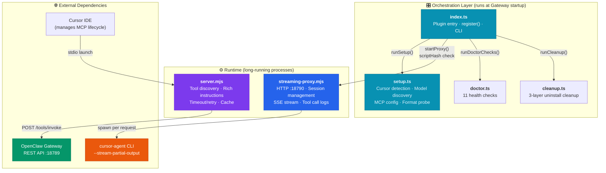
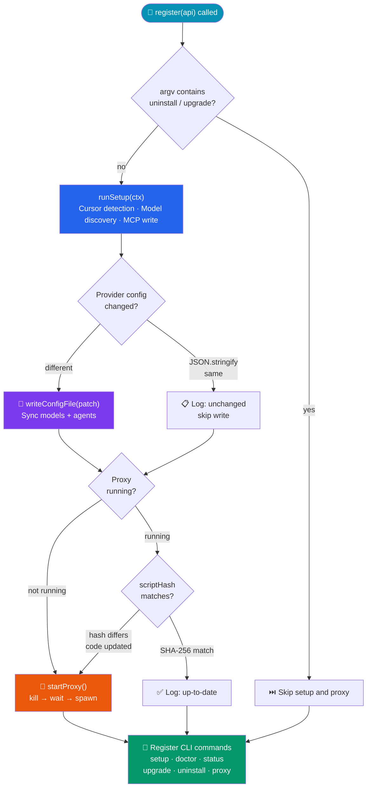
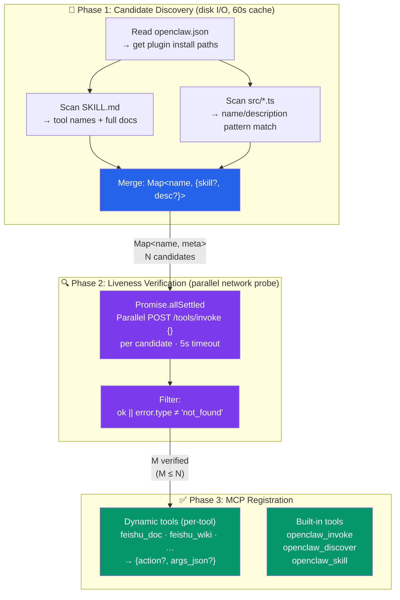
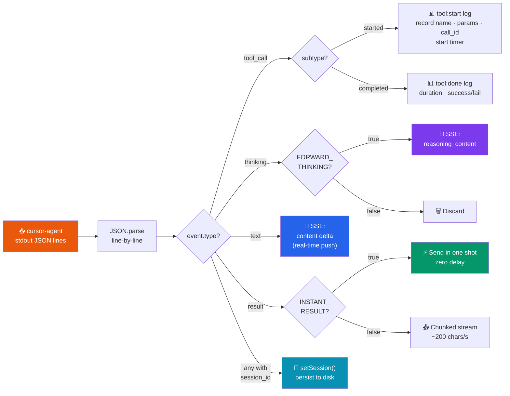
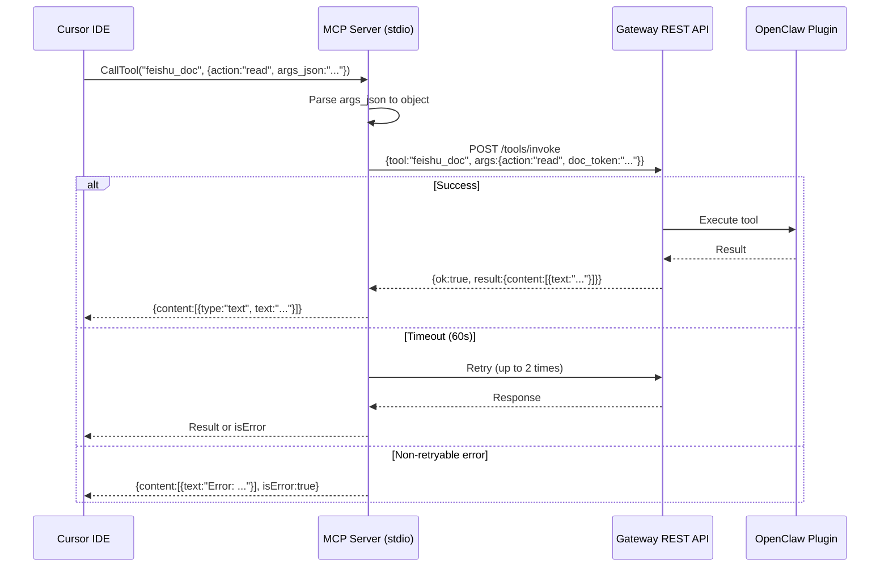
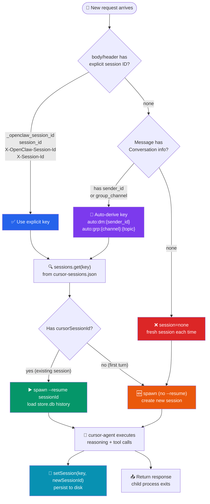
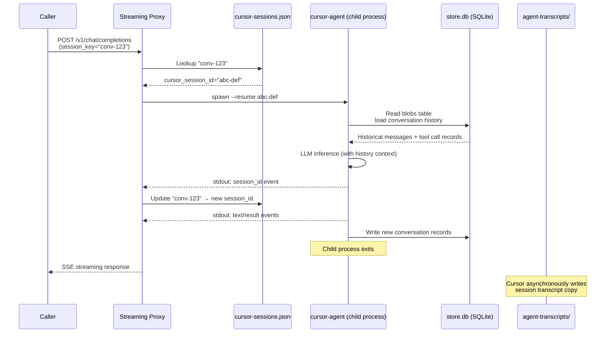
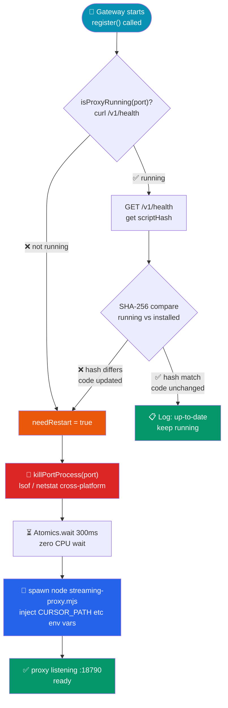

# openclaw-cursor-brain Technical Design Document

> This document is oriented towards technical sharing, with emphasis on architectural design and implementation details. It is suitable for team technical reviews, open-source community presentations, or new contributor onboarding.

---

## Table of Contents

- [Chapter 1: Project Overview](#chapter-1-project-overview)
- [Chapter 2: Overall Architecture](#chapter-2-overall-architecture)
- [Chapter 3: Module Design Details](#chapter-3-module-design-details)
- [Chapter 4: Data Flow Analysis](#chapter-4-data-flow-analysis)
- [Chapter 5: Key Technical Decisions](#chapter-5-key-technical-decisions)
- [Chapter 6: Installation & Configuration](#chapter-6-installation--configuration)
- [Chapter 7: Usage Guide](#chapter-7-usage-guide)
- [Chapter 8: Development & Contributing](#chapter-8-development--contributing)

---

## Chapter 1: Project Overview

### 1.1 One-Line Definition

**openclaw-cursor-brain** is a bidirectional MCP bridge plugin between OpenClaw and Cursor — it enables all OpenClaw messaging channels (Feishu, Slack, Web, etc.) to share Cursor's cutting-edge AI capabilities, while simultaneously giving Cursor IDE native access to the entire OpenClaw plugin ecosystem.

### 1.2 Core Problems Solved

| Problem | Solution |
|---|---|
| OpenClaw needs an AI backend to handle user requests | Wrap Cursor Agent CLI as an OpenAI-compatible Streaming Proxy |
| Cursor IDE cannot directly call external services (Feishu, databases, etc.) | Expose OpenClaw plugin tools to Cursor via MCP Server |
| Tool registration requires manual configuration | Dynamic discovery: source scanning + REST API probing + auto-registration |
| Multiple requests require repeated cold starts | Session persistence + `--resume` session reuse |

### 1.3 Tech Stack

| Component | Technology | Notes |
|---|---|---|
| Runtime | Node.js >= 18 | ESM, SharedArrayBuffer, top-level await support |
| Module System | ESM (`"type": "module"`) | Required by MCP SDK |
| Plugin Entry | TypeScript (`index.ts`) | Type safety via OpenClaw Plugin SDK |
| MCP Server | JavaScript (`server.mjs`) | Needs top-level await; TypeScript compilation too heavy |
| Streaming Proxy | JavaScript (`streaming-proxy.mjs`) | Zero-dependency standalone, lightweight deployment |
| MCP Protocol | `@modelcontextprotocol/sdk` ^1.12.1 | Standard MCP tool registration and stdio transport |
| Schema Validation | `zod` ^3.24.0 | MCP tool parameter validation |

### 1.4 Project Structure

```
openclaw-cursor-brain/
├── index.ts                    # Plugin entry: register() + CLI commands
├── openclaw.plugin.json        # Plugin metadata + config schema
├── package.json                # Dependency declarations
├── src/
│   ├── constants.ts            # Path constants, cross-platform utilities
│   ├── setup.ts                # Idempotent setup: Cursor detection, model discovery, MCP config
│   ├── doctor.ts               # Health checks (11 items)
│   └── cleanup.ts              # Uninstall cleanup (3 layers)
├── mcp-server/
│   ├── server.mjs              # MCP Server: tool discovery + Gateway REST proxy
│   └── streaming-proxy.mjs     # OpenAI-compatible streaming proxy
└── skills/
    └── cursor-brain/
        └── SKILL.md            # Agent skill descriptor
```

---

## Chapter 2: Overall Architecture

### 2.1 Bidirectional Bridge Architecture

The core design of this project is a **bidirectional bridge** — two independent data paths that are decoupled and each solve a different directional problem:

```mermaid
flowchart LR
    subgraph Channels ["📱 Message Channels"]
        direction TB
        CH1["Feishu groups/DMs"]
        CH2["Slack channels"]
        CH3["Web / Custom"]
    end

    subgraph pathA ["Path A: OpenClaw → Cursor (AI Backend)"]
        direction LR
        GW_A["OpenClaw<br/>Gateway"]
        subgraph ProxyDetail ["⚡ Streaming Proxy :18790"]
            direction TB
            API["OpenAI-compatible API"]
            SessionMgr["Session auto-derive<br/>(meta → key → --resume)"]
            API --- SessionMgr
        end
        Agent["🧠 cursor-agent<br/>-p --stream-partial-output<br/>--trust --approve-mcps"]
    end

    subgraph pathB ["Path B: Cursor → OpenClaw (Tool Calls)"]
        direction LR
        subgraph MCPDetail ["🔌 MCP Server (stdio)"]
            direction TB
            MCPCore["Tool proxy + retry"]
            Skills["Rich Instructions<br/>(extractSkillBrief)"]
            MCPCore --- Skills
        end
        GW_B["Gateway<br/>REST API"]
    end

    subgraph Tools ["🛠️ Plugin Ecosystem"]
        direction TB
        T1["feishu_doc<br/>feishu_wiki"]
        T2["GitHub<br/>Slack"]
        T3["Database<br/>Custom plugins"]
    end

    Channels -->|"User messages"| GW_A
    GW_A -->|"POST /v1/chat/completions<br/>(with Conversation info metadata)"| API
    SessionMgr -->|"spawn + stdin<br/>(--resume sessionId)"| Agent
    Agent -->|"stdout: JSON lines<br/>(text/result/tool_call/session_id)"| API
    API -->|"SSE real-time stream<br/>data: {choices:[{delta:{content}}]}"| GW_A
    GW_A -->|"Response"| Channels

    Agent <-->|"MCP stdio<br/>(CallTool)"| MCPCore
    MCPCore -->|"POST /tools/invoke<br/>{tool, args}"| GW_B
    GW_B --> Tools

    style API fill:#2563eb,color:#fff,stroke:#1d4ed8
    style SessionMgr fill:#1e40af,color:#fff,stroke:#1e3a8a
    style MCPCore fill:#7c3aed,color:#fff,stroke:#6d28d9
    style Skills fill:#6d28d9,color:#fff,stroke:#5b21b6
    style Agent fill:#ea580c,color:#fff,stroke:#c2410c
    style GW_A fill:#0891b2,color:#fff,stroke:#0e7490
    style GW_B fill:#0891b2,color:#fff,stroke:#0e7490
```



**Path A** solves the "AI backend" problem: When OpenClaw messaging channels (Feishu groups, Slack channels, etc.) receive user messages, they are forwarded to the Streaming Proxy via the Gateway. The Proxy spawns a cursor-agent process and streams AI responses back in real-time.

**Path B** solves the "tool calling" problem: When Cursor IDE needs to call external tools during reasoning (read Feishu documents, query databases, etc.), it invokes the MCP Server via the MCP protocol, which forwards requests to the OpenClaw Gateway REST API for execution by the corresponding plugin.

### 2.2 Component Relationships



### 2.3 Key Design Decisions

**Why CLI spawn instead of SDK integration?**
cursor-agent is the Cursor IDE's closed-source CLI tool and does not provide a Node.js SDK. The only integration method is subprocess spawning, leveraging its `--output-format stream-json` and `--stream-partial-output` parameters for structured JSON lines output.

**Why .mjs for MCP Server instead of .ts?**
MCP SDK's `McpServer` and `StdioServerTransport` require `await server.connect(transport)` at the module top level. Using `.mjs` files enables direct top-level await without a TypeScript compilation step, reducing deployment complexity.

**Why are Proxy and MCP Server separate processes?**
The MCP Server communicates with Cursor IDE via stdio (launched by `~/.cursor/mcp.json`), with its lifecycle managed by Cursor. The Streaming Proxy is a persistent HTTP server (auto-started by Gateway during startup), with its lifecycle managed by OpenClaw Gateway. Their responsibilities, lifecycles, and communication protocols are fundamentally different, requiring separate processes.

---

## Chapter 3: Module Design Details

### 3.1 Plugin Entry (index.ts)

`index.ts` is the OpenClaw Plugin SDK entry file, exporting a `plugin` object. Its core is the `register()` method, called when the Gateway starts.

#### register() Lifecycle



#### Configuration Deduplication

The Gateway's plugin subsystem and gateway subsystem each call `register()`, potentially triggering `writeConfigFile` twice. The solution is to compare new and existing provider configurations via `JSON.stringify` before writing:

```javascript
// index.ts L237-244
const newProviderConfig = buildProviderConfig(proxyPort, discovered);
const existingProvider = existingProviders[PROVIDER_ID];
const providerUnchanged = existingProvider &&
  JSON.stringify(existingProvider) === JSON.stringify(newProviderConfig);

if (providerUnchanged && providerExists) {
  api.logger.info(`Provider "${PROVIDER_ID}" unchanged ...`);
}
```

#### scriptHash Auto-Restart

After upgrading the plugin, the old proxy process may still be running. Content hashing detects code changes:

1. On startup, the proxy computes the SHA-256 (first 12 characters) of its own script, exposed via `/v1/health`'s `scriptHash` field
2. `register()` fetches the running proxy's `scriptHash` and compares it with the local file hash
3. On mismatch: kill + restart

```javascript
// index.ts L55-59
function computeFileHash(filePath: string): string {
  const content = readFileSync(filePath, "utf-8");
  return createHash("sha256").update(content).digest("hex").slice(0, 12);
}
```

#### CLI Command Tree

```
openclaw cursor-brain
├── setup              # MCP config + interactive model selection
├── doctor             # Health checks (11 items)
├── status             # Version, config, models, tool count
├── upgrade <source>   # One-click upgrade (uninstall → install → model selection)
├── uninstall          # Full uninstall (4-step cleanup)
└── proxy
    ├── (default)       # Show proxy status
    ├── stop            # Stop proxy
    ├── restart         # Restart proxy (detached mode)
    └── log [-n N]      # View last N lines of logs
```

### 3.2 Setup & Configuration (src/setup.ts)

The Setup module handles all initialization and configuration work. Its design goal is **idempotency** — repeated execution produces no side effects.

#### detectCursorPath()

Cross-platform cursor-agent binary detection, in priority order:

1. User-configured `overridePath`
2. `which agent` / `where agent` (PATH lookup)
3. Platform-specific candidate path list (macOS: `~/.local/bin/agent`; Windows: `%LOCALAPPDATA%\Programs\cursor\...`)

#### discoverCursorModels()

Model discovery with retry mechanism:

```typescript
// src/setup.ts L68-109
export function discoverCursorModels(
  cursorPath: string, logger?: PluginLogger,
  { retries = 2, timeoutMs = 30000 } = {},
): CursorModel[] {
  for (let attempt = 0; attempt <= retries; attempt++) {
    // execSync("cursor-agent --list-models")
    // Parse output: "model-id  -  Model Name (annotation)"
    if (attempt < retries) {
      Atomics.wait(new Int32Array(new SharedArrayBuffer(4)), 0, 0, 2000);
    }
  }
}
```

Each retry uses `Atomics.wait` for a 2-second blocking wait — zero CPU overhead, no subprocess, cross-platform compatible.

#### detectOutputFormat()

Probes whether cursor-agent supports the `stream-json` format:

1. If the user explicitly configured `outputFormat`, use it directly
2. Otherwise execute `cursor-agent --help` and check if the output contains `"stream-json"`
3. If supported, use `stream-json` (enables thinking events); otherwise fall back to `json`

#### configureMcpJson()

Idempotent write to `~/.cursor/mcp.json`:

```json
{
  "mcpServers": {
    "openclaw-gateway": {
      "command": "node",
      "args": ["<pluginDir>/mcp-server/server.mjs"],
      "env": {
        "OPENCLAW_GATEWAY_URL": "http://127.0.0.1:<port>",
        "OPENCLAW_GATEWAY_TOKEN": "<token>"
      }
    }
  }
}
```

Before writing, `args` and `env` fields are compared — if already consistent, the write is skipped.

### 3.3 MCP Server (mcp-server/server.mjs)

The MCP Server is the most complex module in this project. It is responsible for exposing all OpenClaw plugin tools as MCP tools for native invocation by Cursor IDE.

#### Three-Phase Tool Discovery



**Phase 1: `discoverCandidateTools()`**

Scans candidate tools from two sources (pure disk I/O, no Gateway dependency):
- **SKILL.md files**: Reads subdirectories under each plugin's `skills/` directory, converts directory names to tool names (e.g., `feishu-doc` → `feishu_doc`), reads the full SKILL.md content (including inlined `references/*.md`)
- **Source scanning** (fallback): Parses `name: "tool_name"` and `description: "..."` patterns in `src/*.ts` files, extracting tool names and descriptions not already covered by SKILL.md

**Phase 2: `discoverVerifiedTools()`**

For each candidate tool, issues a REST probe (`POST /tools/invoke` with empty args) to confirm the tool is actually registered on the Gateway. Uses `Promise.allSettled` for parallel probing with a 5-second timeout.

**Phase 3: Dynamic Registration**

Verified tools are registered to the MCP Server via `server.tool(name, description, schema, handler)`. Each tool uses a unified schema of `{ action?: string, args_json?: string }`. The description is composed from the SKILL.md frontmatter description plus a skill usage hint.

#### Caching Layer

```javascript
let _candidateCache = null;
let _candidateCacheAt = 0;
const CANDIDATE_TTL_MS = 60_000;

function getCachedCandidateTools(forceRefresh = false) {
  if (!forceRefresh && _candidateCache &&
      (Date.now() - _candidateCacheAt) < CANDIDATE_TTL_MS) {
    return _candidateCache;
  }
  _candidateCache = discoverCandidateTools();
  _candidateCacheAt = Date.now();
  return _candidateCache;
}
```

During the startup phase, `discoverCandidateTools()` is called from multiple locations (`buildServerInstructions`, main scope, `getSkillsByTool`). Caching avoids redundant disk I/O. `openclaw_discover` passes `forceRefresh=true` to force a refresh.

#### Server Instructions Construction

`buildServerInstructions()` generates MCP server instructions, embedded in the `McpServer`'s `instructions` field. These instructions appear in Cursor's system prompt, guiding the LLM on how to use tools.

`extractSkillBrief()` extracts key information from SKILL.md:

| Extracted Item | Source | Purpose |
|---|---|---|
| Token extraction rules | `## Token Extraction` section | LLM knows how to extract parameters from URLs |
| Action mapping | `"action"` fields in JSON code blocks | LLM uses precise action strings directly |
| URL patterns | Regex matching `*.cn/path/` | LLM identifies which URLs correspond to which tools |
| Parameter format | First JSON example | LLM knows the parameter format |
| Dependency hints | `**Dependency:**` / `**Note:**` | LLM knows inter-tool dependencies |

Once embedded in server instructions, the LLM can call tools directly, only consulting full documentation (`openclaw_skill`) for complex scenarios.

#### Capability Summary Injection

**Problem**: When the Gateway is slow to start or unavailable, dynamic tools cannot be registered, and the MCP Server only has 3 static tools (`openclaw_invoke`, `openclaw_discover`, `openclaw_skill`). Their descriptions don't mention any specific capabilities (e.g., Feishu documents), so the LLM won't think to use MCP when encountering a Feishu URL.

**Solution**: `buildCapabilitySummary()` generates a capability overview from candidate tool metadata and appends it to the `description` of `openclaw_invoke` and `openclaw_discover`:

```
openclaw_invoke: "Call any OpenClaw Gateway tool by name...
  Available: feishu_doc: Feishu document read/write operations.
  Activate when user mentions Feishu docs, cloud docs, or docx links.;
  feishu_wiki: ...; feishu_drive: ..."
```

Since candidate tools come from disk scanning (Phase 1) and don't depend on the Gateway, even when the Gateway is unavailable, the LLM can learn about available capabilities from static tool descriptions.

#### Lazy-Loaded Skill Cache

`getSkillsByTool()` provides skill content access independent of the Gateway. On first invocation, it extracts all skill-bearing tools from `discoverCandidateTools()` and caches them in memory. The `openclaw_skill` tool uses this function to fetch documentation on demand, without depending on the Gateway probe results at startup.

#### Four Built-in Tools

| Tool | Purpose | Schema |
|---|---|---|
| **Dynamic tools** (per-tool) | Direct Gateway tool invocation | `{ action?, args_json? }` |
| **openclaw_invoke** | Universal invoker for unregistered tools | `{ tool, action?, args_json? }` |
| **openclaw_discover** | List all available tools, flag new ones | `{}` |
| **openclaw_skill** | Get complete usage documentation for a tool | `{ tool }` (comma-separated multi-tool) |

#### Gateway REST Calls

`invokeGatewayTool()` implements REST calls with retry:

- Timeout: 60 seconds by default (`OPENCLAW_TOOL_TIMEOUT_MS`)
- Retry conditions: `AbortError` (timeout), `ECONNREFUSED`, `ECONNRESET`
- Maximum 2 retries (`OPENCLAW_TOOL_RETRY_COUNT`), 1-second interval

### 3.4 Streaming Proxy (mcp-server/streaming-proxy.mjs)

The Streaming Proxy is an OpenAI-compatible HTTP server that wraps the cursor-agent CLI as a standard API.

#### API Endpoints

| Endpoint | Method | Function |
|---|---|---|
| `/v1/chat/completions` | POST | Chat completions (stream/non-stream) |
| `/v1/models` | GET | List available models |
| `/v1/health` | GET | Health check (includes `scriptHash`, `sessions` count) |

#### cursor-agent Process Management

```javascript
// streaming-proxy.mjs L211-227
function spawnCursorAgent(userMsg, sessionKey, requestModel) {
  const args = [
    "-p",
    "--output-format", OUTPUT_FORMAT,
    "--stream-partial-output",
    "--trust", "--approve-mcps", "--force"
  ];
  if (model) args.push("--model", model);
  if (cursorSessionId) args.push("--resume", cursorSessionId);

  const child = spawn(CURSOR_PATH, args, { ... });
  child.stdin.write(userMsg);
  child.stdin.end();
  return child;
}
```

Key parameters:
- `-p`: Non-interactive mode (pipe mode)
- `--stream-partial-output`: Enable incremental output
- `--trust --approve-mcps --force`: Auto-trust MCP tool invocations
- `--resume`: Reuse existing session

#### Event Stream Processing

cursor-agent outputs JSON lines via stdout, one event per line:



#### Stream vs Non-Stream

| Feature | Stream (handleStream) | Non-Stream (handleNonStream) |
|---|---|---|
| Event processing | Real-time line-by-line | Buffered batch processing |
| Response format | SSE (text/event-stream) | JSON (application/json) |
| tool_call timing | Precise (real-time timestamps) | No timing tracked (post-processing) |
| Result output | Incremental delta / instant result | One-shot return |

#### Session Management

**Process model**: Each incoming request spawns a new cursor-agent child process that exits after completing the request. There are no long-running cursor-agent processes — they only exist temporarily while handling a request. Concurrent requests will produce multiple simultaneously running child processes.

**Two-layer Session IDs**:

| Layer | Source | Purpose |
|---|---|---|
| **External session key** | Provided by the caller (body or header) | Identifies "one conversation" from the caller's perspective |
| **cursor session_id** | Returned in cursor-agent output | Represents cursor-agent's internal conversation context, used for `--resume` |

The Proxy maintains an `external key → cursor session_id` mapping to enable cross-request conversation continuity.

**Session key resolution priority** (`resolveSessionKey()`):

1. `body._openclaw_session_id` — OpenClaw-specific field
2. `body.session_id` — Generic field
3. `X-OpenClaw-Session-Id` header
4. `X-Session-Id` header
5. **Message metadata auto-derive** (`meta.auto`) — parsed from `Conversation info` JSON blocks in `messages`

**Auto-derive mechanism** (`extractSessionFromMeta()`):

The OpenClaw Gateway embeds a "Conversation info (untrusted metadata)" JSON block in every user message, containing stable identifiers like `sender_id`, `group_channel`, `topic_id`, and `is_group_chat`. The Proxy extracts this metadata from the last user message via regex and constructs a session key:

- Group chat: `auto:grp:{group_channel}:{topic_id || "main"}`
- Direct message: `auto:dm:{sender_id}`

Log example: `session=auto:dm:ou_f7bdc8b28fc7cc4905d6143c76bde5d0(meta.auto)`

This mechanism solves the problem where Gateway's `openai-completions` provider does not pass explicit session IDs, enabling multi-turn conversation context to be maintained automatically.

**Three-layer storage architecture**:

| Layer | Path | Format | Content |
|---|---|---|---|
| Session mapping | `~/.openclaw/cursor-sessions.json` | JSON array `[[key, id], ...]` | External session key → cursor session_id mapping, max 100 entries (LRU) |
| Conversation history | `~/.cursor/chats/<workspace-hash>/<session-uuid>/store.db` | SQLite 3 | Full conversation records (messages, tool calls, results); `--resume` loads context from here |
| Session transcripts | `~/.cursor/projects/<project>/agent-transcripts/<uuid>.jsonl` | JSONL | Auto-generated conversation transcript copies for review and search |

The `store.db` database contains two tables:
- `meta`: Session metadata (settings, model selection, etc.)
- `blobs`: Conversation content stored as content-hash-keyed blobs (message bodies, tool call parameters and results, etc.)

#### InstantResult Mode

When cursor-agent returns a `result` event (rather than streaming `text`):

- `INSTANT_RESULT=true` (default): Send the complete result in one shot, zero delay
- `INSTANT_RESULT=false`: Simulate streaming output, chunked at 200 chars/s

### 3.5 Health Checks (src/doctor.ts)

`runDoctorChecks()` (L70-185) implements 11 checks:

| # | Check Item | Implementation |
|---|---|---|
| 1 | Plugin version | Read `package.json` |
| 2 | Cursor Agent CLI | `detectCursorPath()` |
| 3 | Cursor Agent version | `cursor-agent --version` |
| 4 | MCP server file | `existsSync()` |
| 5 | MCP SDK dependency | Check `node_modules/@modelcontextprotocol/sdk` |
| 6 | Cursor mcp.json | Parse JSON, check `openclaw-gateway` entry |
| 7 | OpenClaw config | `existsSync(OPENCLAW_CONFIG_PATH)` |
| 8 | Streaming provider | Check `cursor-local` provider config |
| 9 | Output format | `detectOutputFormat()` |
| 10 | Discovered tool count | `countDiscoveredTools()` source scanning |
| 11 | Gateway connectivity | curl / node fetch probing REST API |

Gateway connectivity uses a dual-platform approach: Unix uses `curl` (most efficient), Windows falls back to `node -e "fetch(...)"`.

### 3.6 Cleanup Module (src/cleanup.ts)

`runCleanup()` performs three-layer cleanup:

| Layer | Operation | File |
|---|---|---|
| MCP config | Remove `mcpServers.openclaw-gateway` entry | `~/.cursor/mcp.json` |
| Provider registration | Remove `models.providers.cursor-local` | `~/.openclaw/openclaw.json` |
| Model references | Clear `cursor-local/*` refs from `agents.defaults.model` | `~/.openclaw/openclaw.json` |

Each layer executes independently — failure in one layer does not affect others. All operations are file-level JSON read/write with no external command dependencies.

---

## Chapter 4: Data Flow Analysis

### 4.1 Complete Request Lifecycle

Full sequence for a "summarize Feishu document" request:


### 4.2 Tool Invocation Path

Tool calling path within Cursor IDE:



### 4.3 Session Reuse Flow



**Full storage sequence**:



### 4.4 Proxy Startup/Restart Flow



---

## Chapter 5: Key Technical Decisions

### 5.1 scriptHash vs Version Number

| Approach | Pros | Cons |
|---|---|---|
| package.json version | Simple and direct | Version unchanged for local directory installs |
| **Script content hash** | Accurately detects changes for any install method | Requires additional hash computation |

Content hashing (SHA-256, first 12 characters) was chosen because the plugin supports three installation methods: npm, tgz package, and local directory. Local directory installation is the most common method during development, but the `package.json` version may not be updated after every modification. Content hashing ensures that whenever the script content changes, the proxy automatically restarts.

### 5.2 Atomics.wait vs execSync("sleep")

```typescript
// Old approach: fork subprocess just for waiting
execSync("sleep 2");                  // Unix only, fork overhead

// New approach: zero-overhead synchronous wait
Atomics.wait(new Int32Array(new SharedArrayBuffer(4)), 0, 0, 2000);
```

`Atomics.wait` is available in Node.js >= 16, with advantages:
- Zero CPU overhead (kernel-level wait)
- No subprocess overhead
- Cross-platform (Windows/macOS/Linux)
- Precise millisecond-level control

### 5.3 Rich Tool Descriptions vs openclaw_skill Calls

**Problem**: In the early design, server instructions required the LLM to "call openclaw_skill before first using any tool", adding an extra tool call per request (+3-5 seconds).

**Solution**: Three-layer Progressive Disclosure:

1. **Server instructions** (zero cost): `buildServerInstructions()` + `extractSkillBrief()` extract key information from SKILL.md and embed it in MCP server instructions, covering common operation actions, URL patterns, and parameter examples
2. **Capability summary** (zero cost): `buildCapabilitySummary()` injects an overview of all tools into the `description` of `openclaw_invoke` / `openclaw_discover`, ensuring tools are discoverable even when dynamic tools aren't registered
3. **Full documentation** (on demand): `openclaw_skill` provides complete SKILL.md (all actions, parameters, examples, caveats), invoked only for advanced operations

```
CAPABILITIES:
  - feishu_doc: Feishu document read/write. Token: From URL ... Actions: Read Document(`read`),
    Write Document(`write`), ... Params: pass `action` and remaining fields as `args_json` JSON string.
    Example: { "action": "read", "doc_token": "ABC123def" }. Note: Image display size is ...

USAGE:
  1. When a user mentions URLs or services matching the capabilities above, use the corresponding tool.
  2. Use the token extraction rules and action keys above to call tools directly for common read/write operations.
  3. Call openclaw_skill(tool_name) for advanced operations, complex parameters, or when unsure about usage.
  4. Call openclaw_discover for a refreshed list of all available tools.
```

Result: The LLM can call tools directly for common operations (read, write, append documents, etc.), only consulting full documentation for complex scenarios. Measured reduction: 1 fewer tool call + 3-5 seconds thinking time saved.

### 5.4 InstantResult

**Problem**: cursor-agent sometimes does not stream text deltas, instead returning a single `result` event. The old design used `streamChunked` to simulate streaming at 200 chars/s — 901 characters would take ~4.5 seconds of pure delay.

**Solution**: Default `INSTANT_RESULT=true`, sending the complete result in one shot. `INSTANT_RESULT=false` is retained as a fallback option (some clients may need progressive display).

### 5.5 CORS + Session Headers

**Problem**: OpenClaw Gateway may pass session IDs through different methods (body fields or HTTP headers), and the proxy needs to be compatible with all approaches.

**Solution**:
1. `resolveSessionKey()` extracts from 5 sources by priority (including message metadata auto-derive)
2. Logs record session source (e.g., `session=abc123(header.x-openclaw)` or `session=auto:dm:ou_xxx(meta.auto)`) for debugging
3. CORS allows custom headers: `X-OpenClaw-Session-Id`, `X-Session-Id`

### 5.6 Session Auto-Derive

**Problem**: Gateway's `openai-completions` provider does not pass session IDs in body or headers, resulting in `session=none(none)` on the proxy side. cursor-agent starts a fresh session for every request, completely losing multi-turn conversation context.

**Analysis**: While the Gateway doesn't pass explicit session IDs, it embeds structured "Conversation info (untrusted metadata)" JSON blocks in every user message, containing stable identifiers like `sender_id`, `group_channel`, and `topic_id`.

| Approach | Pros | Cons |
|---|---|---|
| Modify Gateway to pass session header | Protocol-standard, proxy doesn't parse messages | Requires Gateway changes, longer cycle |
| **Auto-derive from message metadata** | Zero Gateway changes, immediate effect | Depends on Gateway's metadata format |

The metadata-based approach was chosen because it requires zero Gateway modifications (non-invasive), takes effect immediately, and the metadata format is already stable. The derivation rules are simple (group chat uses `group_channel:topic_id`, DM uses `sender_id`), and as the lowest-priority fallback in `resolveSessionKey()`, it does not affect any scenario where session IDs are explicitly passed.

### 5.7 Request Safety

**Request body size limit**: `readBody()` enforces a 10 MB maximum to prevent memory exhaustion from malicious oversized requests.

**Client disconnect handling**: `handleStream` tracks client connection state via a `clientGone` flag. When `req.on("close")` fires, the `rl.on("close")` handler checks this flag and skips writing to the already-closed response, preventing write-after-close errors.

---

## Chapter 6: Installation & Configuration

### 6.1 Installation Methods

```bash
# Method 1: npm install (recommended)
openclaw plugins install openclaw-cursor-brain

# Method 2: Local directory install (for development)
openclaw plugins install /path/to/openclaw-cursor-brain

# Method 3: tgz package install
openclaw plugins install openclaw-cursor-brain-1.2.0.tgz
```

After installation, run interactive setup:

```bash
openclaw cursor-brain setup     # MCP config + model selection
openclaw gateway restart         # Apply changes
openclaw cursor-brain doctor     # Verify
```

### 6.2 Auto-Configured Files

| File | Written When | Content |
|---|---|---|
| `~/.cursor/mcp.json` | `setup` / `register()` | MCP Server startup config |
| `~/.openclaw/openclaw.json` | `setup` / `register()` | Provider config + model selection |
| `~/.openclaw/cursor-sessions.json` | Proxy runtime | Session persistence |
| `~/.openclaw/cursor-proxy.log` | Proxy runtime | Proxy logs |

### 6.3 Environment Variables Reference

#### MCP Server Environment Variables

| Variable | Default | Description |
|---|---|---|
| `OPENCLAW_GATEWAY_URL` | `http://127.0.0.1:18789` | Gateway REST API address |
| `OPENCLAW_GATEWAY_TOKEN` | `""` | Gateway auth token |
| `OPENCLAW_CONFIG_PATH` | `~/.openclaw/openclaw.json` | OpenClaw config file path |
| `OPENCLAW_TOOL_TIMEOUT_MS` | `60000` | Tool invocation timeout (ms) |
| `OPENCLAW_TOOL_RETRY_COUNT` | `2` | Max retries for transient errors |

#### Streaming Proxy Environment Variables

| Variable | Default | Description |
|---|---|---|
| `CURSOR_PATH` | Auto-detected | cursor-agent binary path |
| `CURSOR_PROXY_PORT` | `18790` | Proxy listen port |
| `CURSOR_WORKSPACE_DIR` | `""` | cursor-agent working directory |
| `CURSOR_PROXY_API_KEY` | `""` | API Key auth (empty = no auth) |
| `CURSOR_OUTPUT_FORMAT` | `stream-json` | cursor-agent output format |
| `CURSOR_MODEL` | `""` | Model override |
| `CURSOR_PROXY_FORWARD_THINKING` | `false` | Forward LLM reasoning as `reasoning_content` |
| `CURSOR_PROXY_INSTANT_RESULT` | `true` | Send batch results in one shot (no chunking) |
| `CURSOR_PROXY_STREAM_SPEED` | `200` | Chunk speed (chars/s, only when INSTANT_RESULT=false) |
| `CURSOR_PROXY_REQUEST_TIMEOUT` | `300000` | Per-request timeout (5 minutes) |

### 6.4 Plugin Configuration Schema

Under `plugins.entries.openclaw-cursor-brain.config` in `openclaw.json`:

| Field | Type | Default | Description |
|---|---|---|---|
| `cursorPath` | string | Auto-detected | cursor-agent binary path |
| `model` | string | Interactive selection | Primary model (skip interactive if set) |
| `fallbackModel` | string | Interactive selection | Fallback model override |
| `cursorModel` | string | `""` | Passed directly to `--model` parameter |
| `outputFormat` | `"stream-json"` \| `"json"` | Auto-detected | cursor-agent output format |
| `proxyPort` | number | `18790` | Proxy listen port |

---

## Chapter 7: Usage Guide

### 7.1 CLI Command Details

#### setup — Initialize Configuration

```bash
openclaw cursor-brain setup
```

Execution flow: Configure MCP Server → Detect models → Interactive primary model selection (single-select) → Interactive fallback model selection (multi-select) → Save configuration.

#### doctor — Health Checks

```bash
openclaw cursor-brain doctor
```

Sample output:

```
Cursor Brain Doctor

  ✓ Plugin version: v1.2.0
  ✓ Cursor Agent CLI: /Users/me/.local/bin/agent
  ✓ Cursor Agent version: 0.50.5
  ✓ MCP server file: /Users/me/.openclaw/extensions/.../server.mjs
  ✓ MCP SDK dependency: installed
  ✓ Cursor mcp.json: Server "openclaw-gateway" configured
  ✓ OpenClaw config: /Users/me/.openclaw/openclaw.json
  ✓ Streaming provider: "cursor-local" configured
  ✓ Output format (detected): "stream-json" (streaming + thinking)
  ✓ Discovered tool candidates: 7 tools found in plugin sources
  ✓ Gateway REST API: http://127.0.0.1:18789 (HTTP 404)

11/11 checks passed
```

#### status — Status Overview

```bash
openclaw cursor-brain status
```

Displays plugin version, platform, Cursor path/version, output format, proxy status, provider config, model selection, Gateway address, and tool count.

#### upgrade — One-Click Upgrade

```bash
openclaw cursor-brain upgrade ./                    # From local directory
openclaw cursor-brain upgrade openclaw-cursor-brain  # From npm
```

Flow: Uninstall old version → Clean configs → Install new version → Discover models → Interactive selection → Save configuration.

#### proxy Subcommands

```bash
openclaw cursor-brain proxy              # Status
openclaw cursor-brain proxy stop         # Stop
openclaw cursor-brain proxy restart      # Restart
openclaw cursor-brain proxy log          # Last 30 lines of logs
openclaw cursor-brain proxy log -n 100   # Last 100 lines of logs
```

### 7.2 Standalone Proxy Mode

The Streaming Proxy can run independently without OpenClaw, turning any Cursor into an OpenAI-compatible API:

```bash
# Start
node mcp-server/streaming-proxy.mjs

# Start with configuration
CURSOR_PROXY_PORT=8080 \
CURSOR_PROXY_API_KEY=my-secret \
CURSOR_MODEL=sonnet-4.6 \
node mcp-server/streaming-proxy.mjs

# Call
curl http://127.0.0.1:18790/v1/chat/completions \
  -H "Content-Type: application/json" \
  -d '{
    "model": "auto",
    "stream": true,
    "messages": [{"role": "user", "content": "Hello!"}]
  }'
```

### 7.3 Troubleshooting

| Issue | Diagnosis | Solution |
|---|---|---|
| Cursor Agent CLI not found | `openclaw cursor-brain doctor` | Install Cursor and launch once, or set `cursorPath` |
| Gateway unreachable | `openclaw gateway status` | Ensure Gateway is running, check token |
| Tools not appearing | `openclaw cursor-brain status` | Restart Gateway, call `openclaw_discover` in Cursor |
| Tool invocation timeout | Check proxy log | Set `OPENCLAW_TOOL_TIMEOUT_MS=120000` |
| Proxy not starting | `openclaw cursor-brain proxy log` | `proxy restart` to force start |
| Proxy not updated after upgrade | `curl http://127.0.0.1:18790/v1/health` | Check `scriptHash`; `gateway restart` triggers auto-restart |
| Batch response delay | Check proxy startup log | Verify `InstantResult: true` |
| Debug tool calls | `~/.openclaw/cursor-proxy.log` | Search for `tool:start` / `tool:done` |

---

## Chapter 8: Development & Contributing

### 8.1 Local Development Workflow

```bash
# 1. Clone repository
git clone https://github.com/andeya/openclaw-cursor-brain.git
cd openclaw-cursor-brain
npm install

# 2. Install as local plugin
openclaw plugins install ./
openclaw gateway restart

# 3. Sync after code changes
openclaw cursor-brain upgrade ./
openclaw gateway restart

# 4. Verify
openclaw cursor-brain doctor
openclaw cursor-brain status
```

### 8.2 Module Extension Guide

#### Adding New MCP Tools

Add a new `server.tool()` call in `server.mjs`. No other files need modification — the tool discovery mechanism automatically handles new plugin tools from the Gateway.

#### Extending Proxy Functionality

Add new environment variable → Read in config section → Use in handler. Follow existing patterns (e.g., `FORWARD_THINKING`, `INSTANT_RESULT`).

#### Adding New Health Checks

Append a new check in `runDoctorChecks()` in `doctor.ts`:

```typescript
checks.push({
  ok: /* check logic */,
  label: "Check name",
  detail: "Details",
});
```

### 8.3 Design Principles

| Principle | Meaning | Practice |
|---|---|---|
| **Zero Config** | Install and use, no manual config file editing | `register()` auto-detects and auto-writes config |
| **Idempotent** | Repeated execution produces no side effects | Setup compares before writing, cleanup layers independent |
| **Cross-Platform** | macOS, Linux, Windows all supported | `process.platform` branching, path.join, dual-platform commands |
| **Dynamic Discovery** | No hardcoded tool names | Source scanning + REST probe, new plugins auto-register |
| **Progressive Enhancement** | Core features first, advanced features optional | FORWARD_THINKING off by default, INSTANT_RESULT on by default |
| **Observable** | Sufficient logging and diagnostic capability | tool:start/done logs, doctor checks, session source annotation |

---

## Appendix: Constants & Identifiers Quick Reference

| Identifier | Value | Purpose |
|---|---|---|
| `PLUGIN_ID` | `"openclaw-cursor-brain"` | Unique plugin ID |
| `MCP_SERVER_ID` | `"openclaw-gateway"` | MCP server name (written to mcp.json) |
| `PROVIDER_ID` | `"cursor-local"` | LLM Provider name (written to openclaw.json) |
| `DEFAULT_PROXY_PORT` | `18790` | Streaming Proxy default port |
| `CANDIDATE_TTL_MS` | `60000` | Tool cache TTL (60 seconds) |
| `MAX_SESSIONS` | `100` | Max persisted sessions |
| `TOOL_TIMEOUT_MS` | `60000` | Tool invocation timeout (60 seconds) |
| `TOOL_RETRY_COUNT` | `2` | Max tool invocation retries |
| `TOOL_RETRY_DELAY_MS` | `1000` | Retry interval (1 second) |
