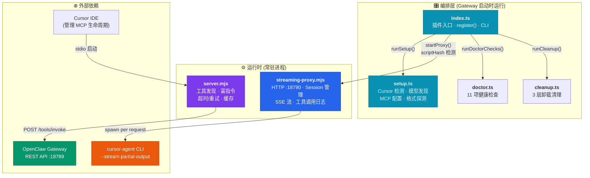
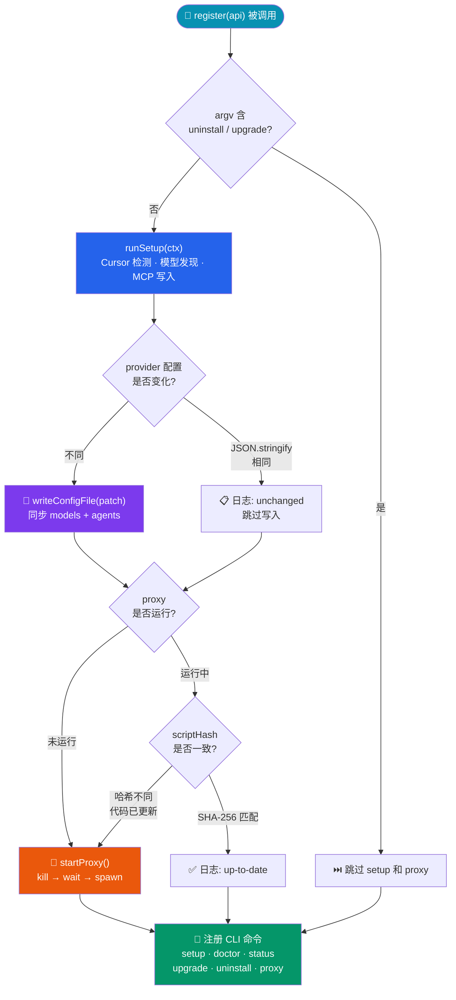
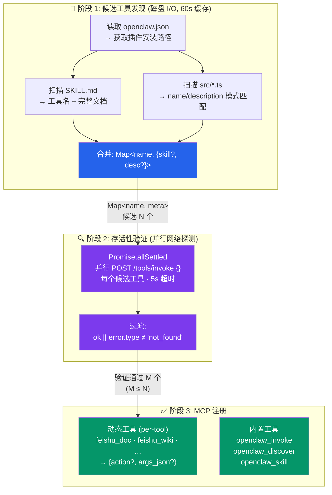
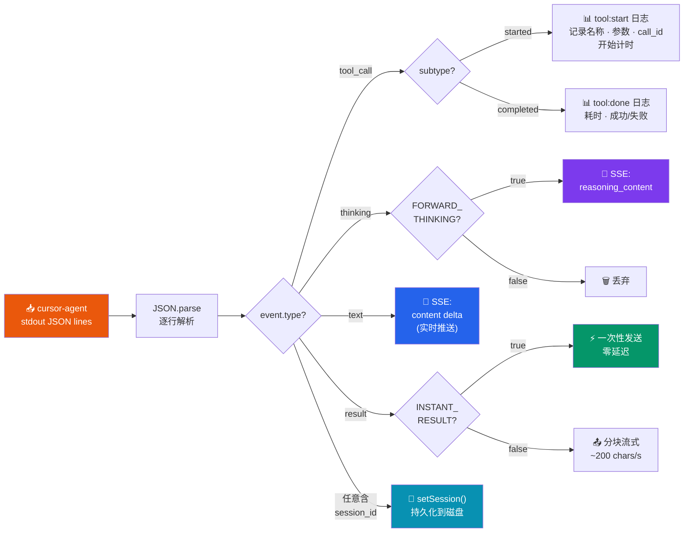
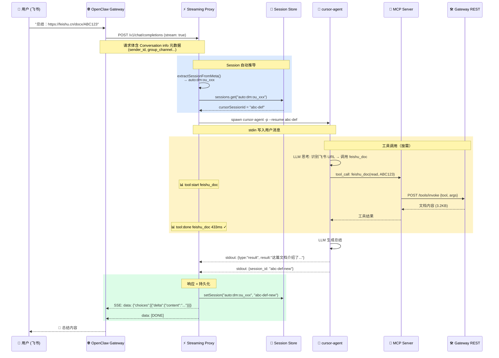
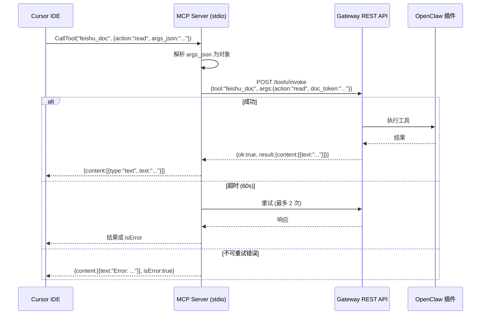
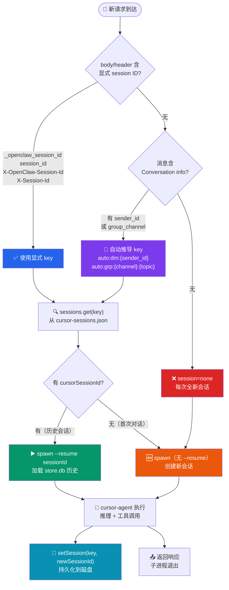
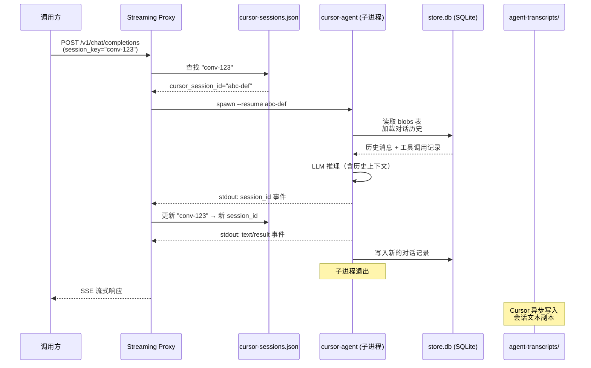
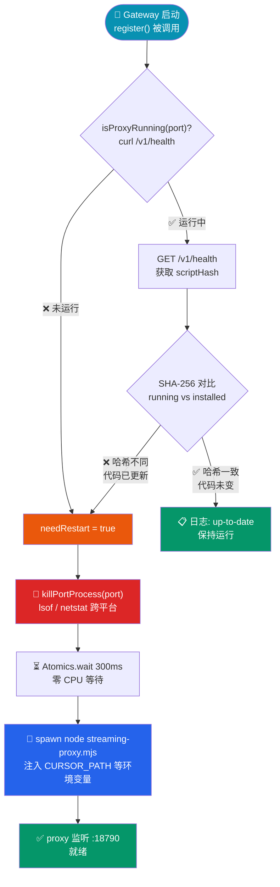

# openclaw-cursor-brain 技术设计文档

> 本文档面向技术分享，侧重架构设计和实现细节。适用于团队技术评审、开源社区交流、或新贡献者上手参考。

---

## 目录

- [第 1 章：项目概述](#第-1-章项目概述)
- [第 2 章：整体架构](#第-2-章整体架构)
- [第 3 章：模块设计详解](#第-3-章模块设计详解)
- [第 4 章：数据流分析](#第-4-章数据流分析)
- [第 5 章：关键技术决策](#第-5-章关键技术决策)
- [第 6 章：安装与配置](#第-6-章安装与配置)
- [第 7 章：使用指南](#第-7-章使用指南)
- [第 8 章：开发与贡献](#第-8-章开发与贡献)

---

## 第 1 章：项目概述

### 1.1 一句话定义

**openclaw-cursor-brain** 是 OpenClaw 与 Cursor 之间的双向 MCP 桥接插件——它让 OpenClaw 生态的所有消息通道（飞书、Slack、Web 等）共享 Cursor 的前沿 AI 能力，同时让 Cursor IDE 原生调用 OpenClaw 生态的全部插件工具。

### 1.2 解决的核心问题

| 问题 | 解决方案 |
|---|---|
| OpenClaw 需要一个 AI 后端来处理用户请求 | 将 Cursor Agent CLI 封装为 OpenAI 兼容的 Streaming Proxy |
| Cursor IDE 无法直接调用外部服务（飞书、数据库等） | 通过 MCP Server 将 OpenClaw 插件工具暴露给 Cursor |
| 工具注册需要手动配置 | 动态发现机制：源码扫描 + REST API 探测 + 自动注册 |
| 多次请求需要重复冷启动 | Session 持久化 + `--resume` 会话复用 |

### 1.3 技术栈

| 组件 | 技术 | 说明 |
|---|---|---|
| 运行环境 | Node.js >= 18 | 支持 ESM、SharedArrayBuffer、top-level await |
| 模块系统 | ESM (`"type": "module"`) | MCP SDK 要求 ESM |
| 插件入口 | TypeScript (`index.ts`) | OpenClaw 插件 SDK 类型安全 |
| MCP Server | JavaScript (`server.mjs`) | 需要 top-level await，TypeScript 编译配置过重 |
| Streaming Proxy | JavaScript (`streaming-proxy.mjs`) | 零依赖独立运行，轻量部署 |
| MCP 协议 | `@modelcontextprotocol/sdk` ^1.12.1 | 标准 MCP 工具注册和 stdio 传输 |
| Schema 校验 | `zod` ^3.24.0 | MCP 工具参数校验 |

### 1.4 项目结构

```
openclaw-cursor-brain/
├── index.ts                    # 插件入口：register() + CLI 命令
├── openclaw.plugin.json        # 插件元数据 + 配置 schema
├── package.json                # 依赖声明
├── src/
│   ├── constants.ts            # 路径常量、跨平台工具函数
│   ├── setup.ts                # 幂等安装：Cursor 检测、模型发现、MCP 配置
│   ├── doctor.ts               # 健康检查（11 项）
│   └── cleanup.ts              # 卸载清理（3 层）
├── mcp-server/
│   ├── server.mjs              # MCP Server：工具发现 + Gateway REST 代理
│   └── streaming-proxy.mjs     # OpenAI 兼容流式代理
└── skills/
    └── cursor-brain/
        └── SKILL.md            # Agent 技能描述文件
```

---

## 第 2 章：整体架构

### 2.1 双向桥接架构

本项目的核心设计是**双向桥接**——两条独立的数据通路互不依赖，各自解决一个方向的问题：

```mermaid
flowchart LR
    subgraph Channels ["📱 消息通道"]
        direction TB
        CH1["飞书群/私聊"]
        CH2["Slack 频道"]
        CH3["Web / 自定义"]
    end

    subgraph pathA ["路径 A: OpenClaw → Cursor（AI 后端）"]
        direction LR
        GW_A["OpenClaw<br/>Gateway"]
        subgraph ProxyDetail ["⚡ Streaming Proxy :18790"]
            direction TB
            API["OpenAI 兼容 API"]
            SessionMgr["Session 自动推导<br/>(meta → key → --resume)"]
            API --- SessionMgr
        end
        Agent["🧠 cursor-agent<br/>-p --stream-partial-output<br/>--trust --approve-mcps"]
    end

    subgraph pathB ["路径 B: Cursor → OpenClaw（工具调用）"]
        direction LR
        subgraph MCPDetail ["🔌 MCP Server (stdio)"]
            direction TB
            MCPCore["工具代理 + 重试"]
            Skills["Rich Instructions<br/>(extractSkillBrief)"]
            MCPCore --- Skills
        end
        GW_B["Gateway<br/>REST API"]
    end

    subgraph Tools ["🛠️ 插件生态"]
        direction TB
        T1["feishu_doc<br/>feishu_wiki"]
        T2["GitHub<br/>Slack"]
        T3["Database<br/>自定义插件"]
    end

    Channels -->|"用户消息"| GW_A
    GW_A -->|"POST /v1/chat/completions<br/>(含 Conversation info 元数据)"| API
    SessionMgr -->|"spawn + stdin<br/>(--resume sessionId)"| Agent
    Agent -->|"stdout: JSON lines<br/>(text/result/tool_call/session_id)"| API
    API -->|"SSE 实时流<br/>data: {choices:[{delta:{content}}]}"| GW_A
    GW_A -->|"回复"| Channels

    Agent <-->|"MCP stdio<br/>(CallTool)"| MCPCore
    MCPCore -->|"POST /tools/invoke<br/>{tool, args}"| GW_B
    GW_B --> Tools

    style API fill:#2563eb,color:#fff,stroke:#1d4ed8
    style SessionMgr fill:#1e40af,color:#fff,stroke:#1e3a8a
    style MCPCore fill:#7c3aed,color:#fff,stroke:#6d28d9
    style Skills fill:#6d28d9,color:#fff,stroke:#5b21b6
    style Agent fill:#ea580c,color:#fff,stroke:#c2410c
    style GW_A fill:#0891b2,color:#fff,stroke:#0e7490
    style GW_B fill:#0891b2,color:#fff,stroke:#0e7490
```



**路径 A**（上方）解决"AI 后端"问题：消息通道收到用户请求后，Gateway 以 OpenAI 格式 POST 到 Streaming Proxy。Proxy 自动从消息元数据推导 session key，用 `--resume` 复用 cursor-agent 会话，实时流式返回 AI 响应。

**路径 B**（下方）解决"工具调用"问题：cursor-agent 推理过程中需要外部工具时，通过 MCP 协议调用 MCP Server，后者将请求转发到 Gateway REST API。MCP Server 指令中嵌入了丰富的工具描述，使 LLM 可以直接调用而非先查文档。

### 2.2 组件关系



### 2.3 关键设计决策

**为什么用 CLI spawn 而非 SDK 集成？**
cursor-agent 是 Cursor IDE 的闭源 CLI 工具，不提供 Node.js SDK。唯一的集成方式是通过子进程 spawn，利用其 `--output-format stream-json` 和 `--stream-partial-output` 参数获取结构化 JSON lines 输出。

**为什么 MCP Server 用 .mjs 而非 .ts？**
MCP SDK 的 `McpServer` 和 `StdioServerTransport` 需要在模块顶层使用 `await server.connect(transport)`。使用 `.mjs` 文件可以直接 top-level await，无需 TypeScript 编译步骤，减少部署复杂度。

**为什么 Proxy 和 MCP Server 是两个独立进程？**
MCP Server 通过 stdio 与 Cursor IDE 通信（由 `~/.cursor/mcp.json` 配置启动），其生命周期由 Cursor 管理。Streaming Proxy 是一个常驻 HTTP 服务器（由 Gateway 启动时自动拉起），其生命周期由 OpenClaw Gateway 管理。两者职责、生命周期、通信协议均不同，必须是独立进程。

---

## 第 3 章：模块设计详解

### 3.1 插件入口 (index.ts)

`index.ts` 是 OpenClaw 插件 SDK 的入口文件，导出一个 `plugin` 对象。核心是 `register()` 方法，在 Gateway 启动时被调用。

#### register() 生命周期



#### 配置去重

Gateway 的插件子系统和 gateway 子系统会各调用一次 `register()`，导致 `writeConfigFile` 可能执行两次。解决方案是在写入前用 `JSON.stringify` 对比新旧 provider 配置：

```javascript
// index.ts L237-244
const newProviderConfig = buildProviderConfig(proxyPort, discovered);
const existingProvider = existingProviders[PROVIDER_ID];
const providerUnchanged = existingProvider &&
  JSON.stringify(existingProvider) === JSON.stringify(newProviderConfig);

if (providerUnchanged && providerExists) {
  api.logger.info(`Provider "${PROVIDER_ID}" unchanged ...`);
}
```

#### scriptHash 自动重启

升级插件后，旧的 proxy 进程仍在运行。通过内容哈希检测代码变更：

1. proxy 启动时计算自身脚本的 SHA-256 前 12 位，暴露在 `/v1/health` 的 `scriptHash` 字段
2. `register()` 获取运行中 proxy 的 `scriptHash`，与本地文件哈希对比
3. 不一致则 kill + 重启

```javascript
// index.ts L55-59
function computeFileHash(filePath: string): string {
  const content = readFileSync(filePath, "utf-8");
  return createHash("sha256").update(content).digest("hex").slice(0, 12);
}
```

#### CLI 命令树

```
openclaw cursor-brain
├── setup              # MCP 配置 + 交互式模型选择
├── doctor             # 健康检查（11 项）
├── status             # 版本、配置、模型、工具数量
├── upgrade <source>   # 一键升级（卸载旧版 → 安装新版 → 模型选择）
├── uninstall          # 完整卸载（4 步清理）
└── proxy
    ├── (默认)          # 显示代理状态
    ├── stop            # 停止代理
    ├── restart         # 重启代理（detached 模式）
    └── log [-n N]      # 查看最近 N 行日志
```

### 3.2 安装配置 (src/setup.ts)

Setup 模块负责所有初始化和配置工作，设计目标是**幂等**——重复执行不产生副作用。

#### detectCursorPath()

跨平台的 cursor-agent 二进制检测，优先级：

1. 用户配置的 `overridePath`
2. `which agent` / `where agent` (PATH 查找)
3. 平台特定候选路径列表（macOS: `~/.local/bin/agent`; Windows: `%LOCALAPPDATA%\Programs\cursor\...`）

#### discoverCursorModels()

带重试的模型发现机制：

```typescript
// src/setup.ts L68-109
export function discoverCursorModels(
  cursorPath: string, logger?: PluginLogger,
  { retries = 2, timeoutMs = 30000 } = {},
): CursorModel[] {
  for (let attempt = 0; attempt <= retries; attempt++) {
    // execSync("cursor-agent --list-models")
    // 解析输出: "model-id  -  Model Name (annotation)"
    if (attempt < retries) {
      Atomics.wait(new Int32Array(new SharedArrayBuffer(4)), 0, 0, 2000);
    }
  }
}
```

每次重试间使用 `Atomics.wait` 阻塞等待 2 秒，零 CPU 开销、无子进程、跨平台兼容。

#### detectOutputFormat()

探测 cursor-agent 是否支持 `stream-json` 格式：

1. 若用户显式配置了 `outputFormat`，直接使用
2. 否则执行 `cursor-agent --help`，检查输出是否包含 `"stream-json"`
3. 支持则用 `stream-json`（可获取 thinking 事件），否则降级为 `json`

#### configureMcpJson()

幂等写入 `~/.cursor/mcp.json`：

```json
{
  "mcpServers": {
    "openclaw-gateway": {
      "command": "node",
      "args": ["<pluginDir>/mcp-server/server.mjs"],
      "env": {
        "OPENCLAW_GATEWAY_URL": "http://127.0.0.1:<port>",
        "OPENCLAW_GATEWAY_TOKEN": "<token>"
      }
    }
  }
}
```

写入前对比 `args` 和 `env` 字段，已一致则跳过。

### 3.3 MCP Server (mcp-server/server.mjs)

MCP Server 是本项目最复杂的模块，负责将 OpenClaw 的所有插件工具暴露为 MCP 工具，让 Cursor IDE 原生调用。

#### 工具发现三阶段



**阶段 1: `discoverCandidateTools()`**

从两个来源扫描候选工具（纯磁盘 I/O，不依赖 Gateway）：
- **SKILL.md 文件**：读取每个插件 `skills/` 目录下的子目录，目录名转换为工具名（如 `feishu-doc` → `feishu_doc`），读取完整 SKILL.md 内容（含内联的 `references/*.md`）
- **源码扫描**（fallback）：解析 `src/*.ts` 文件中的 `name: "tool_name"` 和 `description: "..."` 模式，提取未被 SKILL.md 覆盖的工具名和描述

**阶段 2: `discoverVerifiedTools()`**

对每个候选工具发起 REST probe（`POST /tools/invoke` 带空参数），确认 Gateway 上确实注册了该工具。使用 `Promise.allSettled` 并行探测，5 秒超时。

**阶段 3: 动态注册**

通过 `server.tool(name, description, schema, handler)` 将验证通过的工具注册到 MCP Server。每个工具的 schema 统一为 `{ action?: string, args_json?: string }`。description 由 SKILL.md frontmatter 描述 + skill 使用提示组成。

#### 缓存层

```javascript
let _candidateCache = null;
let _candidateCacheAt = 0;
const CANDIDATE_TTL_MS = 60_000;

function getCachedCandidateTools(forceRefresh = false) {
  if (!forceRefresh && _candidateCache &&
      (Date.now() - _candidateCacheAt) < CANDIDATE_TTL_MS) {
    return _candidateCache;
  }
  _candidateCache = discoverCandidateTools();
  _candidateCacheAt = Date.now();
  return _candidateCache;
}
```

启动阶段 `discoverCandidateTools()` 被多处调用（`buildServerInstructions`、主作用域、`getSkillsByTool`），缓存避免重复磁盘 I/O。`openclaw_discover` 传 `forceRefresh=true` 强制刷新。

#### 服务器指令构建

`buildServerInstructions()` 生成 MCP 服务器指令，嵌入到 `McpServer` 的 `instructions` 字段。这些指令会出现在 Cursor 的系统提示中，指导 LLM 如何使用工具。

`extractSkillBrief()` 从 SKILL.md 中提取关键信息：

| 提取项 | 来源 | 目的 |
|---|---|---|
| Token 提取规则 | `## Token Extraction` 节 | LLM 知道如何从 URL 提取参数 |
| Action 映射 | JSON 代码块中的 `"action"` 字段 | LLM 直接使用精确 action 字符串 |
| URL 模式 | 正则匹配 `*.cn/path/` | LLM 识别哪些 URL 对应哪个工具 |
| 参数格式 | 首个 JSON 示例 | LLM 知道参数格式 |
| 依赖提示 | `**Dependency:**` / `**Note:**` | LLM 知道工具间的依赖关系 |

这些信息嵌入服务器指令后，LLM 可以直接调用工具而无需先调 `openclaw_skill` 获取文档，减少一次工具调用。

#### 能力简介注入

**问题**：当 Gateway 启动慢或不可用时，动态工具无法注册，MCP Server 只有 3 个静态工具（`openclaw_invoke`、`openclaw_discover`、`openclaw_skill`）。此时它们的 description 不提及任何具体能力（如飞书文档），LLM 看到飞书 URL 时不会想到使用 MCP。

**解决**：`buildCapabilitySummary()` 从候选工具元数据中生成一段能力简介，附加到 `openclaw_invoke` 和 `openclaw_discover` 的 description 末尾：

```
openclaw_invoke: "Call any OpenClaw Gateway tool by name...
  Available: feishu_doc: Feishu document read/write operations.
  Activate when user mentions Feishu docs, cloud docs, or docx links.;
  feishu_wiki: ...; feishu_drive: ..."
```

由于候选工具来自磁盘扫描（阶段 1），不依赖 Gateway，即使 Gateway 不可用，LLM 也能从静态工具的 description 中知道有哪些能力。

#### 延迟加载的 Skill 缓存

`getSkillsByTool()` 提供独立于 Gateway 的 skill 内容访问。首次调用时从 `discoverCandidateTools()` 提取所有带 skill 的工具，缓存在内存中。`openclaw_skill` 工具使用此函数按需获取文档，不依赖启动时的 Gateway 探测结果。

#### 四个内置工具

| 工具 | 用途 | Schema |
|---|---|---|
| **动态工具** (per-tool) | 直接调用 Gateway 上的工具 | `{ action?, args_json? }` |
| **openclaw_invoke** | 通用调用器，适用于未直接注册的工具 | `{ tool, action?, args_json? }` |
| **openclaw_discover** | 列出所有可用工具，标识新增工具 | `{}` |
| **openclaw_skill** | 获取工具的完整使用文档 | `{ tool }` (支持逗号分隔多工具) |

#### Gateway REST 调用

`invokeGatewayTool()` 实现带重试的 REST 调用：

- 超时：默认 60 秒（`OPENCLAW_TOOL_TIMEOUT_MS`）
- 重试条件：`AbortError`（超时）、`ECONNREFUSED`、`ECONNRESET`
- 最多重试 2 次（`OPENCLAW_TOOL_RETRY_COUNT`），间隔 1 秒

### 3.4 Streaming Proxy (mcp-server/streaming-proxy.mjs)

Streaming Proxy 是一个 OpenAI 兼容的 HTTP 服务器，将 cursor-agent CLI 封装为标准 API。

#### API 端点

| 端点 | 方法 | 功能 |
|---|---|---|
| `/v1/chat/completions` | POST | 聊天补全（支持 stream/non-stream） |
| `/v1/models` | GET | 列出可用模型 |
| `/v1/health` | GET | 健康检查（含 `scriptHash`、`sessions` 数） |

#### cursor-agent 进程管理

```javascript
// streaming-proxy.mjs L211-227
function spawnCursorAgent(userMsg, sessionKey, requestModel) {
  const args = [
    "-p",
    "--output-format", OUTPUT_FORMAT,
    "--stream-partial-output",
    "--trust", "--approve-mcps", "--force"
  ];
  if (model) args.push("--model", model);
  if (cursorSessionId) args.push("--resume", cursorSessionId);

  const child = spawn(CURSOR_PATH, args, { ... });
  child.stdin.write(userMsg);
  child.stdin.end();
  return child;
}
```

关键参数：
- `-p`：非交互模式（pipe mode）
- `--stream-partial-output`：启用增量输出
- `--trust --approve-mcps --force`：自动信任 MCP 工具调用
- `--resume`：复用已有会话

#### 事件流处理

cursor-agent 通过 stdout 输出 JSON lines，每行一个事件：



#### 流式 vs 非流式

| 特性 | 流式 (handleStream) | 非流式 (handleNonStream) |
|---|---|---|
| 事件处理 | 实时逐行处理 | 缓冲后批量处理 |
| 响应格式 | SSE (text/event-stream) | JSON (application/json) |
| tool_call 计时 | 精确（实时 timestamp） | 不跟踪耗时（事后处理） |
| 结果输出 | 增量 delta / instant result | 一次性返回 |

#### Session 管理

**进程模型**：每次请求到达时，Proxy spawn 一个新的 cursor-agent 子进程处理，处理完毕后子进程退出。全局不存在常驻的 cursor-agent 进程——只有在处理请求时才临时存在。并发请求会产生多个同时运行的子进程。

**两层 Session ID**：

| 层 | 来源 | 用途 |
|---|---|---|
| **外部 session key** | 请求方传入（body 或 header） | 代表"一个对话"在调用方视角的标识 |
| **cursor session_id** | cursor-agent 输出中返回 | 代表 cursor-agent 内部的会话上下文，用于 `--resume` |

Proxy 维护一个 `外部 key → cursor session_id` 的映射，实现跨请求的会话连续性。

**Session Key 解析优先级**（`resolveSessionKey()`）：

1. `body._openclaw_session_id` — OpenClaw 专用字段
2. `body.session_id` — 通用字段
3. `X-OpenClaw-Session-Id` header
4. `X-Session-Id` header
5. **消息元数据自动推导**（`meta.auto`）— 从 `messages` 中的 `Conversation info` JSON 块解析

**自动推导原理**（`extractSessionFromMeta()`）：

OpenClaw Gateway 在每条用户消息中嵌入 "Conversation info (untrusted metadata)" JSON 块，包含 `sender_id`、`group_channel`、`topic_id`、`is_group_chat` 等稳定标识符。Proxy 从最后一条 user 消息中用正则提取该 JSON，据此构建 session key：

- 群聊：`auto:grp:{group_channel}:{topic_id || "main"}`
- 私聊：`auto:dm:{sender_id}`

日志示例：`session=auto:dm:ou_f7bdc8b28fc7cc4905d6143c76bde5d0(meta.auto)`

这一机制解决了 Gateway 的 `openai-completions` provider 不传递显式 session ID 的问题，使多轮对话上下文自动保持。

**三层存储架构**：

| 层 | 路径 | 格式 | 内容 |
|---|---|---|---|
| 会话映射 | `~/.openclaw/cursor-sessions.json` | JSON 数组 `[[key, id], ...]` | 外部 session key → cursor session_id 的映射，最多 100 条（LRU） |
| 对话历史 | `~/.cursor/chats/<workspace-hash>/<session-uuid>/store.db` | SQLite 3 | cursor-agent 的完整对话记录（消息、工具调用、结果），`--resume` 从此加载上下文 |
| 会话文本 | `~/.cursor/projects/<project>/agent-transcripts/<uuid>.jsonl` | JSONL | Cursor 自动生成的会话记录副本，供回顾和搜索 |

其中 `store.db` 包含两张表：
- `meta`：会话元数据（如设置、模型选择等）
- `blobs`：对话内容，以内容哈希为 key 的 blob 存储（消息体、工具调用参数和结果等）

#### InstantResult 模式

当 cursor-agent 返回 `result` 事件（而非流式 `text`）时：

- `INSTANT_RESULT=true`（默认）：一次性发送完整结果，零延迟
- `INSTANT_RESULT=false`：模拟流式输出，按 200 chars/s 分块发送

### 3.5 健康检查 (src/doctor.ts)

`runDoctorChecks()` (L70-185) 实现 11 项检查：

| # | 检查项 | 实现方式 |
|---|---|---|
| 1 | 插件版本 | 读取 `package.json` |
| 2 | Cursor Agent CLI | `detectCursorPath()` |
| 3 | Cursor Agent 版本 | `cursor-agent --version` |
| 4 | MCP server 文件 | `existsSync()` |
| 5 | MCP SDK 依赖 | 检查 `node_modules/@modelcontextprotocol/sdk` |
| 6 | Cursor mcp.json | 解析 JSON，检查 `openclaw-gateway` 条目 |
| 7 | OpenClaw 配置 | `existsSync(OPENCLAW_CONFIG_PATH)` |
| 8 | Streaming provider | 检查 `cursor-local` provider 配置 |
| 9 | Output format | `detectOutputFormat()` |
| 10 | 发现的工具数 | `countDiscoveredTools()` 源码扫描 |
| 11 | Gateway 连通性 | curl / node fetch 探测 REST API |

Gateway 连通性检测使用双平台方案：Unix 用 `curl`（最高效），Windows 回退到 `node -e "fetch(...)"`。

### 3.6 清理模块 (src/cleanup.ts)

`runCleanup()` 执行三层清理：

| 层 | 操作 | 文件 |
|---|---|---|
| MCP 配置 | 删除 `mcpServers.openclaw-gateway` 条目 | `~/.cursor/mcp.json` |
| Provider 注册 | 删除 `models.providers.cursor-local` | `~/.openclaw/openclaw.json` |
| 模型引用 | 清除 `agents.defaults.model` 中的 `cursor-local/*` 引用 | `~/.openclaw/openclaw.json` |

每层独立执行，某层失败不影响其他层。所有操作都是文件级 JSON 读写，不依赖外部命令。

---

## 第 4 章：数据流分析

### 4.1 完整请求生命周期

以"总结飞书文档"为例的完整时序：



### 4.2 工具调用链路

Cursor IDE 中的工具调用路径：



### 4.3 Session 复用流程



**完整存储时序**：



### 4.4 Proxy 启动/重启流程



---

## 第 5 章：关键技术决策

### 5.1 scriptHash vs 版本号

| 方案 | 优点 | 缺点 |
|---|---|---|
| package.json 版本号 | 简单直接 | 本地目录安装时版本号不变但代码已变 |
| **脚本内容哈希** | 任何安装方式下均准确检测变更 | 需要额外的哈希计算 |

选择内容哈希（SHA-256 前 12 位）的原因：插件支持三种安装方式——npm、tgz 包、本地目录。本地目录安装是开发阶段最常用的方式，但 `package.json` 版本可能不会每次修改后更新。内容哈希确保只要脚本内容变了，proxy 就会自动重启。

### 5.2 Atomics.wait vs execSync("sleep")

```typescript
// 旧方案：fork 子进程仅为等待
execSync("sleep 2");                  // Unix only, fork overhead

// 新方案：零开销同步等待
Atomics.wait(new Int32Array(new SharedArrayBuffer(4)), 0, 0, 2000);
```

`Atomics.wait` 在 Node.js >= 16 可用，优势：
- 零 CPU 开销（内核级等待）
- 无子进程开销
- 跨平台（Windows/macOS/Linux）
- 精确的毫秒级控制

### 5.3 富工具描述 vs openclaw_skill 调用

**问题**：早期设计中，服务器指令要求 LLM "首次使用工具前必须调 openclaw_skill 获取文档"，每次请求多一次工具调用（+3-5 秒）。

**解决方案**：三层渐进披露（Progressive Disclosure）：

1. **服务器指令**（零成本）：`buildServerInstructions()` + `extractSkillBrief()` 从 SKILL.md 中提取关键信息嵌入 MCP 服务器指令，覆盖常见操作的 action、URL 模式、参数示例
2. **能力简介**（零成本）：`buildCapabilitySummary()` 将所有工具的简介注入 `openclaw_invoke` / `openclaw_discover` 的 description，确保即使动态工具未注册也能被发现
3. **完整文档**（按需）：`openclaw_skill` 提供完整 SKILL.md（含所有 action、参数、示例、注意事项），仅在高级操作时按需调用

```
CAPABILITIES:
  - feishu_doc: Feishu document read/write. Token: From URL ... Actions: Read Document(`read`),
    Write Document(`write`), ... Params: pass `action` and remaining fields as `args_json` JSON string.
    Example: { "action": "read", "doc_token": "ABC123def" }. Note: Image display size is ...

USAGE:
  1. When a user mentions URLs or services matching the capabilities above, use the corresponding tool.
  2. Use the token extraction rules and action keys above to call tools directly for common read/write operations.
  3. Call openclaw_skill(tool_name) for advanced operations, complex parameters, or when unsure about usage.
  4. Call openclaw_discover for a refreshed list of all available tools.
```

效果：LLM 对常见操作可以直接调用工具（读、写、追加文档等），仅在复杂场景才需要查阅完整文档。实测减少 1 次工具调用 + 3-5 秒思考时间。

### 5.4 InstantResult

**问题**：cursor-agent 有时不流式输出 text delta，而是一次性返回 `result` 事件。旧设计中 `streamChunked` 以 200 chars/s 模拟流式，901 字符需要 ~4.5 秒纯延迟。

**解决方案**：默认 `INSTANT_RESULT=true`，一次性发送完整结果。保留 `INSTANT_RESULT=false` 作为回退选项（某些客户端可能需要渐进式显示）。

### 5.5 CORS + Session Header

**问题**：OpenClaw Gateway 可能通过不同方式传递 session ID（body 字段或 HTTP header），proxy 需要兼容所有方式。

**解决方案**：
1. `resolveSessionKey()` 按优先级从 5 个来源提取（含消息元数据自动推导）
2. 日志记录 session 来源（如 `session=abc123(header.x-openclaw)` 或 `session=auto:dm:ou_xxx(meta.auto)`），便于调试
3. CORS 允许自定义 header：`X-OpenClaw-Session-Id`, `X-Session-Id`

### 5.6 Session 自动推导

**问题**：Gateway 的 `openai-completions` provider 不在 body 或 header 中传递 session ID，导致 proxy 端 `session=none(none)`，cursor-agent 每次请求都是全新会话，多轮对话完全丢失上下文。

**分析**：Gateway 虽不传递显式 session ID，但在每条用户消息中嵌入了结构化的 "Conversation info (untrusted metadata)" JSON 块，包含 `sender_id`、`group_channel`、`topic_id` 等稳定标识符。

| 方案 | 优点 | 缺点 |
|---|---|---|
| 修改 Gateway 传递 session header | 协议标准、proxy 无需解析消息 | 需要 Gateway 改动，周期长 |
| **从消息元数据自动推导** | 零 Gateway 改动，立即生效 | 依赖 Gateway 嵌入元数据的格式 |

选择从消息元数据推导的原因：不依赖 Gateway 改动（零侵入）、即时生效、且元数据格式已稳定。推导规则简单明确（群聊用 `group_channel:topic_id`，私聊用 `sender_id`），作为 `resolveSessionKey()` 的最低优先级回退，不影响任何显式传递 session ID 的场景。

### 5.7 请求安全

**请求体大小限制**：`readBody()` 限制最大 10 MB，防止恶意客户端发送超大请求体导致内存耗尽。

**客户端断连处理**：`handleStream` 中通过 `clientGone` 标志位追踪客户端连接状态。当 `req.on("close")` 触发后，`rl.on("close")` 中检测该标志位并跳过对已关闭 response 的写入，避免 write-after-close 错误。

---

## 第 6 章：安装与配置

### 6.1 安装方式

```bash
# 方式 1: npm 安装（推荐）
openclaw plugins install openclaw-cursor-brain

# 方式 2: 本地目录安装（开发用）
openclaw plugins install /path/to/openclaw-cursor-brain

# 方式 3: tgz 包安装
openclaw plugins install openclaw-cursor-brain-1.2.0.tgz
```

安装后运行交互式配置：

```bash
openclaw cursor-brain setup     # MCP 配置 + 模型选择
openclaw gateway restart         # 应用更改
openclaw cursor-brain doctor     # 验证
```

### 6.2 自动配置的文件

| 文件 | 写入时机 | 内容 |
|---|---|---|
| `~/.cursor/mcp.json` | `setup` / `register()` | MCP Server 启动配置 |
| `~/.openclaw/openclaw.json` | `setup` / `register()` | Provider 配置 + 模型选择 |
| `~/.openclaw/cursor-sessions.json` | proxy 运行时 | Session 持久化 |
| `~/.openclaw/cursor-proxy.log` | proxy 运行时 | Proxy 日志 |

### 6.3 环境变量完整参考

#### MCP Server 环境变量

| 变量 | 默认值 | 说明 |
|---|---|---|
| `OPENCLAW_GATEWAY_URL` | `http://127.0.0.1:18789` | Gateway REST API 地址 |
| `OPENCLAW_GATEWAY_TOKEN` | `""` | Gateway 认证 token |
| `OPENCLAW_CONFIG_PATH` | `~/.openclaw/openclaw.json` | OpenClaw 配置文件路径 |
| `OPENCLAW_TOOL_TIMEOUT_MS` | `60000` | 工具调用超时（毫秒） |
| `OPENCLAW_TOOL_RETRY_COUNT` | `2` | 瞬态错误最大重试次数 |

#### Streaming Proxy 环境变量

| 变量 | 默认值 | 说明 |
|---|---|---|
| `CURSOR_PATH` | 自动检测 | cursor-agent 二进制路径 |
| `CURSOR_PROXY_PORT` | `18790` | Proxy 监听端口 |
| `CURSOR_WORKSPACE_DIR` | `""` | cursor-agent 工作目录 |
| `CURSOR_PROXY_API_KEY` | `""` | API Key 认证（空 = 无认证） |
| `CURSOR_OUTPUT_FORMAT` | `stream-json` | cursor-agent 输出格式 |
| `CURSOR_MODEL` | `""` | 模型覆盖 |
| `CURSOR_PROXY_FORWARD_THINKING` | `false` | 转发 LLM 推理过程为 `reasoning_content` |
| `CURSOR_PROXY_INSTANT_RESULT` | `true` | 批量结果一次性发送（不分块） |
| `CURSOR_PROXY_STREAM_SPEED` | `200` | 分块速度（chars/s，仅 INSTANT_RESULT=false） |
| `CURSOR_PROXY_REQUEST_TIMEOUT` | `300000` | 单请求超时（5 分钟） |

### 6.4 插件配置 Schema

在 `openclaw.json` 的 `plugins.entries.openclaw-cursor-brain.config` 下：

| 字段 | 类型 | 默认值 | 说明 |
|---|---|---|---|
| `cursorPath` | string | 自动检测 | cursor-agent 二进制路径 |
| `model` | string | 交互选择 | 主模型（设置后跳过交互） |
| `fallbackModel` | string | 交互选择 | 备用模型覆盖 |
| `cursorModel` | string | `""` | 直接传递给 `--model` 参数 |
| `outputFormat` | `"stream-json"` \| `"json"` | 自动检测 | cursor-agent 输出格式 |
| `proxyPort` | number | `18790` | Proxy 监听端口 |

---

## 第 7 章：使用指南

### 7.1 CLI 命令详解

#### setup — 初始化配置

```bash
openclaw cursor-brain setup
```

执行流程：配置 MCP Server → 检测模型 → 交互选择主模型（单选）→ 交互选择备用模型（多选）→ 保存配置。

#### doctor — 健康检查

```bash
openclaw cursor-brain doctor
```

输出示例：

```
Cursor Brain Doctor

  ✓ Plugin version: v1.2.0
  ✓ Cursor Agent CLI: /Users/me/.local/bin/agent
  ✓ Cursor Agent version: 0.50.5
  ✓ MCP server file: /Users/me/.openclaw/extensions/.../server.mjs
  ✓ MCP SDK dependency: installed
  ✓ Cursor mcp.json: Server "openclaw-gateway" configured
  ✓ OpenClaw config: /Users/me/.openclaw/openclaw.json
  ✓ Streaming provider: "cursor-local" configured
  ✓ Output format (detected): "stream-json" (streaming + thinking)
  ✓ Discovered tool candidates: 7 tools found in plugin sources
  ✓ Gateway REST API: http://127.0.0.1:18789 (HTTP 404)

11/11 checks passed
```

#### status — 状态概览

```bash
openclaw cursor-brain status
```

显示插件版本、平台、Cursor 路径/版本、输出格式、proxy 状态、provider 配置、模型选择、Gateway 地址、工具数量。

#### upgrade — 一键升级

```bash
openclaw cursor-brain upgrade ./                    # 从本地目录
openclaw cursor-brain upgrade openclaw-cursor-brain  # 从 npm
```

流程：卸载旧版 → 清理配置 → 安装新版 → 发现模型 → 交互选择 → 保存配置。

#### proxy 子命令

```bash
openclaw cursor-brain proxy              # 状态
openclaw cursor-brain proxy stop         # 停止
openclaw cursor-brain proxy restart      # 重启
openclaw cursor-brain proxy log          # 最近 30 行日志
openclaw cursor-brain proxy log -n 100   # 最近 100 行日志
```

### 7.2 独立 Proxy 模式

Streaming Proxy 可以脱离 OpenClaw 独立运行，将任何 Cursor 变为 OpenAI 兼容 API：

```bash
# 启动
node mcp-server/streaming-proxy.mjs

# 带配置启动
CURSOR_PROXY_PORT=8080 \
CURSOR_PROXY_API_KEY=my-secret \
CURSOR_MODEL=sonnet-4.6 \
node mcp-server/streaming-proxy.mjs

# 调用
curl http://127.0.0.1:18790/v1/chat/completions \
  -H "Content-Type: application/json" \
  -d '{
    "model": "auto",
    "stream": true,
    "messages": [{"role": "user", "content": "Hello!"}]
  }'
```

### 7.3 故障排查

| 问题 | 排查方法 | 解决方案 |
|---|---|---|
| Cursor Agent CLI not found | `openclaw cursor-brain doctor` | 安装 Cursor 并启动一次，或设置 `cursorPath` |
| Gateway 不可达 | `openclaw gateway status` | 确认 Gateway 运行中，检查 token |
| 工具未出现 | `openclaw cursor-brain status` | 重启 Gateway，在 Cursor 中调 `openclaw_discover` |
| 工具调用超时 | 查看 proxy log | 设置 `OPENCLAW_TOOL_TIMEOUT_MS=120000` |
| Proxy 未启动 | `openclaw cursor-brain proxy log` | `proxy restart` 强制启动 |
| 升级后 proxy 未更新 | `curl http://127.0.0.1:18790/v1/health` | 检查 `scriptHash`；`gateway restart` 触发自动重启 |
| 批量响应延迟 | 检查 proxy 启动日志 | 确认 `InstantResult: true` |
| 调试工具调用 | `~/.openclaw/cursor-proxy.log` | 搜索 `tool:start` / `tool:done` |

---

## 第 8 章：开发与贡献

### 8.1 本地开发流程

```bash
# 1. 克隆仓库
git clone https://github.com/andeya/openclaw-cursor-brain.git
cd openclaw-cursor-brain
npm install

# 2. 安装为本地插件
openclaw plugins install ./
openclaw gateway restart

# 3. 修改代码后同步
openclaw cursor-brain upgrade ./
openclaw gateway restart

# 4. 验证
openclaw cursor-brain doctor
openclaw cursor-brain status
```

### 8.2 模块扩展指南

#### 添加新的 MCP 工具

在 `server.mjs` 中添加新的 `server.tool()` 调用即可。无需修改其他文件——工具发现机制会自动处理来自 Gateway 的新插件工具。

#### 扩展 Proxy 功能

新增环境变量 → 在配置区读取 → 在 handler 中使用。遵循现有模式（如 `FORWARD_THINKING`、`INSTANT_RESULT`）。

#### 添加新的健康检查

在 `doctor.ts` 的 `runDoctorChecks()` 中追加新的检查项：

```typescript
checks.push({
  ok: /* 检查逻辑 */,
  label: "检查名称",
  detail: "详细信息",
});
```

### 8.3 设计原则

| 原则 | 含义 | 实践 |
|---|---|---|
| **零配置** | 安装即用，无需手动修改配置文件 | `register()` 自动检测、自动写入配置 |
| **幂等** | 重复执行不产生副作用 | setup 写入前对比、cleanup 独立分层 |
| **跨平台** | macOS、Linux、Windows 均支持 | `process.platform` 分支、path.join、双平台命令 |
| **动态发现** | 不硬编码工具名 | 源码扫描 + REST probe，新插件自动注册 |
| **渐进增强** | 核心功能优先，高级功能可选 | FORWARD_THINKING 默认关、INSTANT_RESULT 默认开 |
| **可观测** | 充分的日志和诊断能力 | tool:start/done 日志、doctor 检查、session 来源标注 |

---

## 附录：常量与标识符速查

| 标识符 | 值 | 用途 |
|---|---|---|
| `PLUGIN_ID` | `"openclaw-cursor-brain"` | 插件唯一 ID |
| `MCP_SERVER_ID` | `"openclaw-gateway"` | MCP 服务器名（写入 mcp.json） |
| `PROVIDER_ID` | `"cursor-local"` | LLM Provider 名（写入 openclaw.json） |
| `DEFAULT_PROXY_PORT` | `18790` | Streaming Proxy 默认端口 |
| `CANDIDATE_TTL_MS` | `60000` | 工具缓存 TTL (60 秒) |
| `MAX_SESSIONS` | `100` | 最大 session 持久化数量 |
| `TOOL_TIMEOUT_MS` | `60000` | 工具调用超时 (60 秒) |
| `TOOL_RETRY_COUNT` | `2` | 工具调用最大重试次数 |
| `TOOL_RETRY_DELAY_MS` | `1000` | 重试间隔 (1 秒) |
